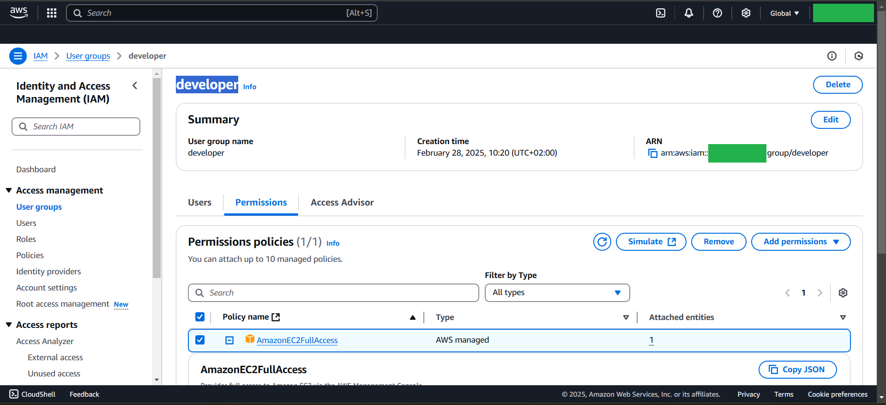

# Lab1


## Budget
```bash
# 1. Search for "Billing and Cost Management"
# 2. Create AWS-Budget by 5$ 
# 3. AWS will send SNS Message on your Email if the budget exceeds 50%
```


# IAM Group
```bash
# 1. Search for "IAM"
# 2. Create Croup called "admin" ---> AdministratorAccess
# 3. Create Croup called "developer" ---> AmazonEC2FullAccess
```
## admin-group

## developer-group



# admin-1
```bash
# 1. Search for "IAM"
# 2. Create User called "admin-1" to "access Console Only" & Enable MFA & {Download .csv file}
```
##

### Output


# admin-2-prog
```bash
# 1. Search for "IAM"
# 2. Create User called "admin-2-prog" with "CLI access Only"
# 3. List all User & Groups using Commands

# 4. from Permissions ---> Add Permissions ---> create inline policy ---> IAM ---> Choose {ListUsers, ListGroups}

# 5. from Security credentials 
#        Create access key  --->  (CLI)  --->  Download .csv file
--------------------------------------------------
```
##


## Commands to List Users & Groups
```bash
aws iam list-users --query "Users[*].UserName"
aws iam list-groups --query "Groups[*].GroupName"
```
### Output


## dev-userg
```bash
# 1. Search for "IAM"
# 2. Create User called "dev-user" with "Programmatic & Console access"

# 3. User can access EC2 & S3 Only

# 4. Add MFA
# 5. Add Access Key & Secret Access Key  ---> 
#                 Create access key  --->  (CLI)  --->  Download .csv file
```
##


## Commands to List S3 & EC2
```bash
aws s3 ls
aws ec2 describe-instances --query "Reservations[*].Instances[*].InstanceId"
```
### Output
