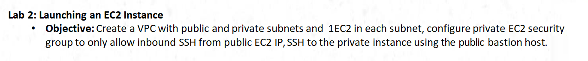
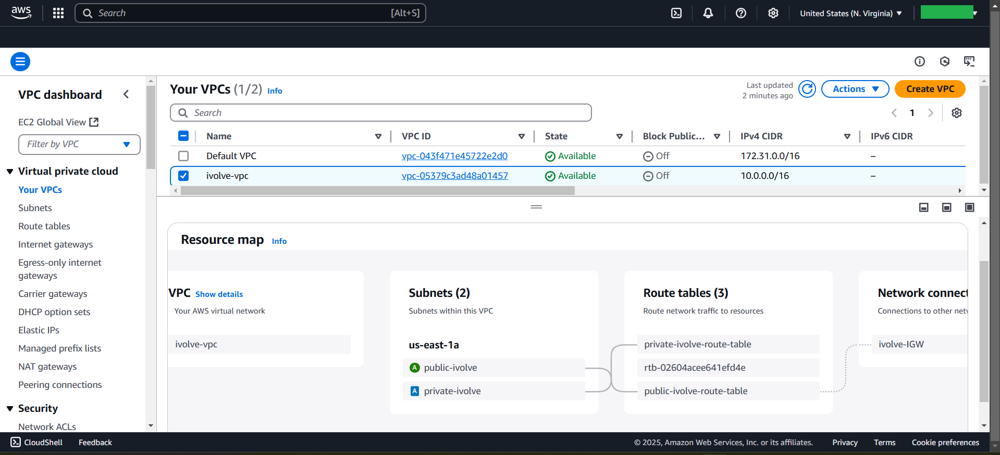
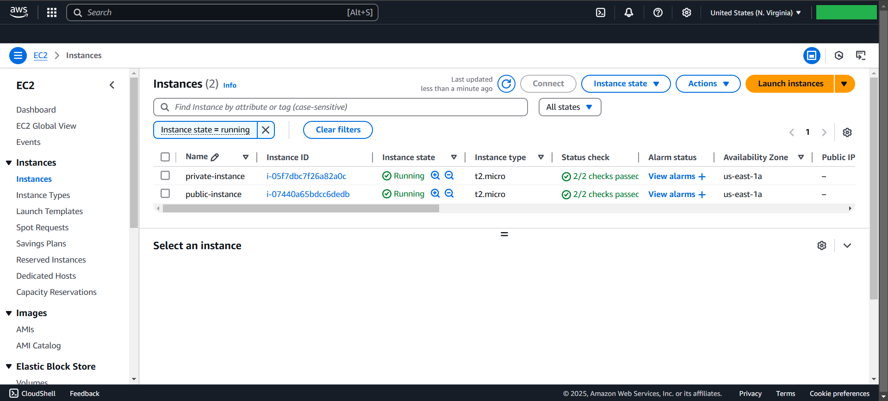
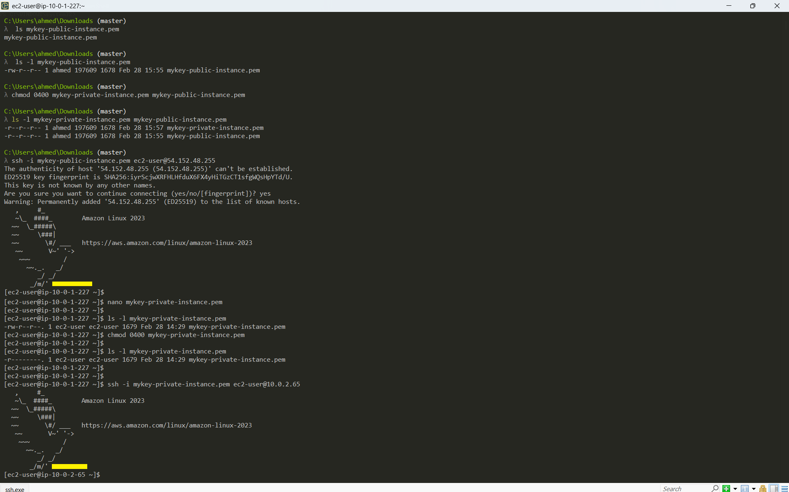

# Lab2



# VPC
```bash
1. Create ivolve-VPC with CIDR-BLOCK: 10.0.0.0/16

2. Create ivolve-IGW & attach with ivolve-VPC

3. Create 2-Subnet
   - public-ivolve-subnet in AVs ---> us-east-1a
        $  subnetID: 10.0.1.0/24
   - private-ivolve-subnet in AVs ---> us-east-1a
        $ subnetID: 10.0.2.0/24

4. Create 2-route table
   - public-ivolve-route-table
        $ Route table --->  route to [ 0.0.0.0/0 ]
        $ Subnet associations ---> public-ivolve-subnet
   - private-ivolve-route-table
        $ Route table --->
        $ Subnet associations ---> private-ivolve-subnet

```



# 2-EC2
```bash
Create 2-Instance
    - Public-instance (bastion-host) 
    - private-instance
```


# 2-SGs
```bash
Create 2-SGs allow Only SSH
    - 1. SG-public-instance attach with Public-instance
            SG allow SSH(outbound) to private-instance (SG-Chaining)
    - 2. SG-private-instance attach with private-instance
            SG allow SSH(Inbound) from only Public-instance
```


# Output

