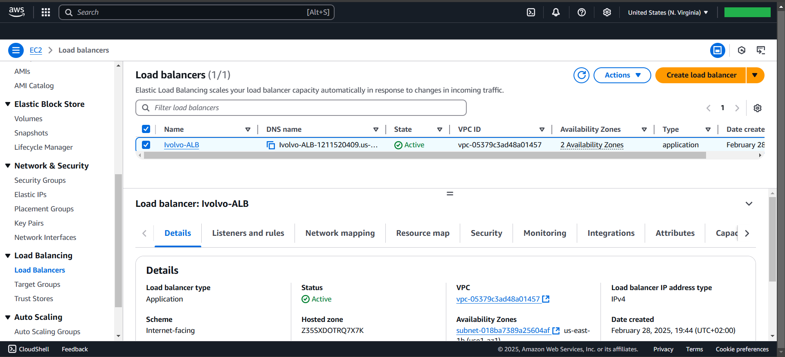

# Lab2


# VPC
```bash
1. Create ivolve-VPC with CIDR-BLOCK: 10.0.0.0/16

2. Create ivolve-IGW & attach with ivolve-VPC

3. Create 2-Subnet
   - public-ivolve-subnet1 in AVs ---> us-east-1a
        $  subnetID: 10.0.1.0/24
   - public-ivolve-subnet2 in AVs ---> us-east-1b
        $ subnetID: 10.0.2.0/24

4. Create 2-route table
   - public-ivolve-route-table1
        $ Route table --->  route to [ 0.0.0.0/0 ]
        $ Subnet associations ---> public-ivolve-subnet1
   - private-ivolve-route-table2
        $ Route table --->  route to [ 0.0.0.0/0 ]
        $ Subnet associations ---> public-ivolve-subnet2

```


# 2-SGs
```bash
Create 2-SGs allow Only HTTP & HTTPS
    - 1. SG-Nginx attach with Nginx-Instance
            SG allow HTTP & HTTPS
    - 2. SG-Apache attach with Apache-Instance
            SG allow HTTP & HTTPS
```


# 2-EC2
```bash
Create 2-Instance
    - Nginx-instance in AVs  ---> us-east-1a
    - Apache-instance in AVs ---> us-east-1b
```


# Nginx-instance User Data
```bash
#!/bin/bash
yum update -y
yum install nginx -y
systemctl enable --now nginx 
echo "Ivolve-Nginx" > /usr/share/nginx/html/index.html
systemctl restart nginx
```
# Apache-instance User Data
```bash
#!/bin/bash
yum update -y
yum install httpd -y
systemctl enable --now httpd
echo "Ivolve-Apache"  > /var/www/html/index.html
systemctl restart httpd
```

# Target-Group
```bash
   $ target type  --->  instances
   $ port  --->  80
   $ VPC   --->  ivolve-vpc
   $ Available instances  --->  Choose {Nginx-instance, Apache-instance}
                          --->  Include as pending below (Targets)
   $ Listener { 80 }
```


# Application Load Balancer
```bash
- Ivolvo-ALB
- Internet Facing
- VPC     --->  ivolve-vpc
- AZ      --->  us-east-1a , us-east-1b
- SG      --->  SG-public-instance allow HTTP & HTTPS
- Target group  --->  Ivolve-TG
```



# Output Nginx-instance


# Output Apache-instance

