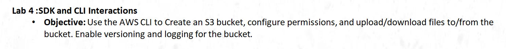
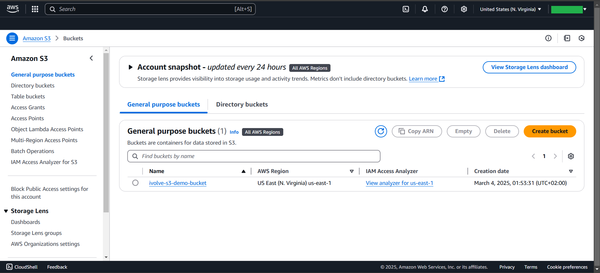
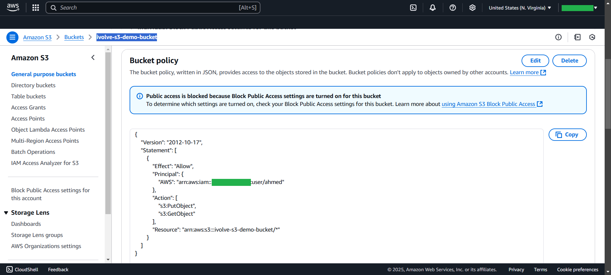
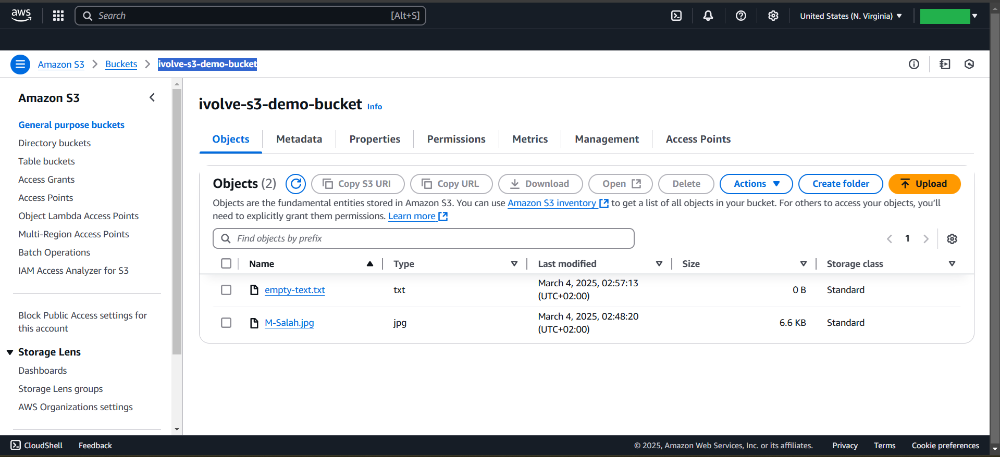
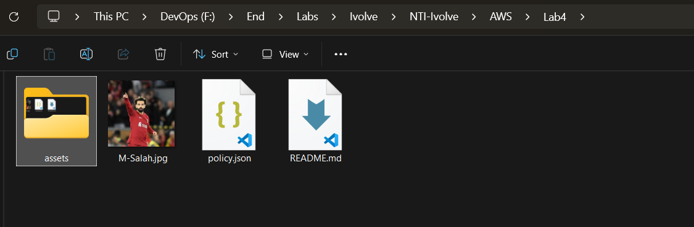
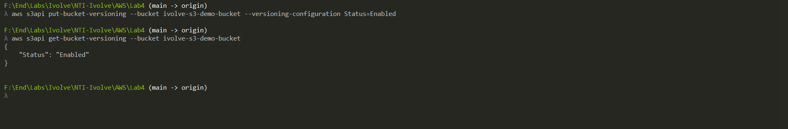
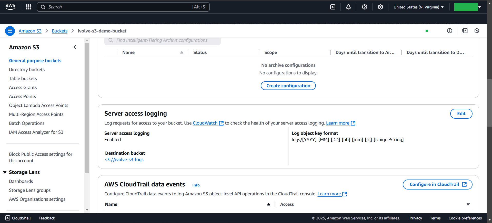
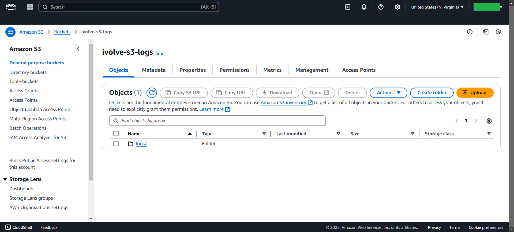

# Lab2



# Create S3-Bucket:
```bash
# Create S3-Bucket:
aws s3api create-bucket --bucket ivolve-s3-demo-bucket --region us-east-1

# List S3-Bucket:
aws s3 ls
aws s3api list-buckets
```
## Output



# Configure Permissions:
```bash
{
    "Version": "2012-10-17",
    "Statement": [
      {
        "Effect": "Allow",
        "Principal": { "AWS": "arn:aws:iam::<Account-ID>:user/ahmed" },
        "Action": 
        [
            "s3:PutObject",
            "s3:GetObject"
        ],
        "Resource": "arn:aws:s3:::ivolve-s3-demo-bucket/*"
      }
    ]
  }

# to apply Permission
aws s3api put-bucket-policy --bucket ivolve-s3-demo-bucket --policy file://policy.jso
```
## Output



# Upload image & file to the bucket:
```bash
aws s3 cp "./assets/M-Salah.jpg" s3://ivolve-s3-demo-bucket/
aws s3 cp assets\empty-text.txt s3://ivolve-s3-demo-bucket/
```
## Output



# Download file from the bucket:
```bash
aws s3 cp s3://ivolve-s3-demo-bucket/M-Salah.jpg .
```
## Output



# Enable versioning for the bucket
```bash
# Enable Versioning
aws s3api put-bucket-versioning --bucket ivolve-s3-demo-bucket --versioning-configuration Status=Enabled

# Verify That Versioning is Enabled
aws s3api get-bucket-versioning --bucket ivolve-s3-demo-bucket

```
## Output



# Enable logging for the bucket
```bash
1. Create {another Bucket}
aws s3api create-bucket --bucket ivolve-s3-logs --region us-east-1

2. Set Permissions on the Logging Bucket: ---> logging-policy.json
--------------------------------------------------------------------
{
  "Version": "2012-10-17",
  "Statement": [
    {
      "Effect": "Allow",
      "Principal": {
        "Service": "logging.s3.amazonaws.com"
      },
      "Action": "s3:PutObject",
      "Resource": "arn:aws:s3:::ivolve-s3-logs/*",
      "Condition": {
        "ArnLike": {
          "aws:SourceArn": "arn:aws:s3:::ivolve-s3-demo-bucket"
        }
      }
    }
  ]
}
--------------------------------------------------------------------

3. Apply the policy to ivolve-s3-logs:
aws s3api put-bucket-policy --bucket ivolve-s3-logs --policy file://logging-policy.json

4. Enable Logging for ivolve-s3-demo-bucket
5. Create file with this Content: ---> logging-config.json
----------------------------------------------------------
{
    "LoggingEnabled": {
        "TargetBucket": "ivolve-s3-logs",
        "TargetPrefix": "logs/"
    }
}
----------------------------------------------------------
6. apply the logging settings:
aws s3api put-bucket-logging --bucket ivolve-s3-demo-bucket --bucket-logging-status file://logging-config.json

7. Ensure that Logging is enabled
aws s3api get-bucket-logging --bucket ivolve-s3-demo-bucket

8. Upload a Test File & Check Logs
aws s3 cp test-file.txt s3://ivolve-s3-demo-bucket/

9. Wait for AWS to Generate Logs:
aws s3 ls s3://ivolve-s3-demo-bucket/logs/

```
## Output

## Logs Output



# to Delete all Buckets
```bash
# List All S3 Buskets
aws s3api list-buckets --query "Buckets[].Name"


# Empty Each S3 Bucket
aws s3 rb s3://<BUCKET_NAME> --force


# Delete All S3 Bucket
for bucket in $(aws s3api list-buckets --query "Buckets[].Name" --output text); do
  aws s3 rb s3://$bucket --force
done
```