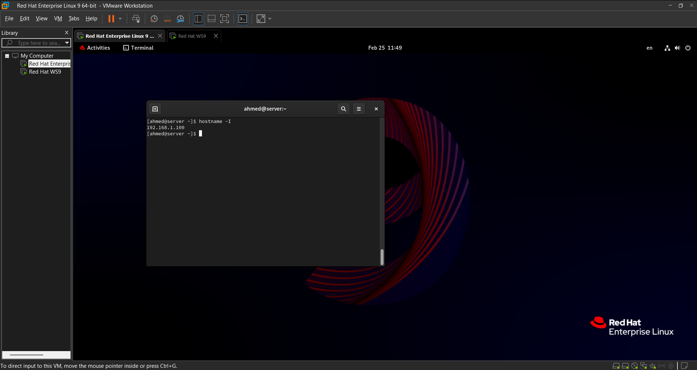
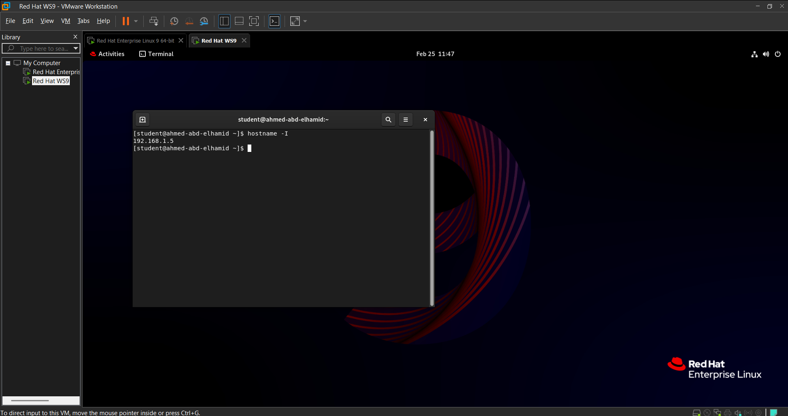
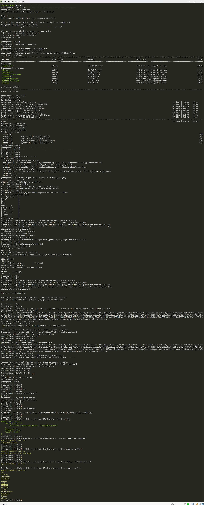

# Lab1
## Architecture


### Create 2 VMs



# Install Ansible on VMs
```bash
# After Create 2 VMs

# Check if Python installed
python --version

# Install Ansible on VM1
su
yum install ansible-core -y

# Ensure Ansible Installed
ansible --version

```
# Configure SSH
```bash

# Generate Key-Pair
ssh-keygen -t rsa -b 4096 -f ~/.ssh/ansible_key

# Copy Public-IP to another VM
ssh-copy-id -i ~/.ssh/ansible_key.pub student@192.168.1.5
----------------------------------------------------------------------------------------------------------------
# because i copy Public-Key to another VM before 
# I will conect with VM2 with Old Public-Key and remove {authoized_keys} & copy new Public-key

sftp student@192.168.1.5
cd .ssh
rm authorized_keys
exit

# Copy Public-IP to another VM
ssh-copy-id -i ~/.ssh/ansible_key.pub student@192.168.1.5

# Ensure that {First VM} can connect to {Second VM}
ssh -i ~/.ssh/ivolve_key student@192.168.1.5
----------------------------------------------------------------------------------------------------------------
```

# Configure Ansible
```bash

mkdir ansible
cd ansible

----------------------------------------------
# Default Configuration File
vim ansible.cfg

[defaults]
inventory = /root/ansible/inventory
private_key_file = ~/.ssh/ansible_key
host_key_checking = False
----------------------------------------------


-----------------------------------------------------------------------------------------------------
# Include IPs
vim inventory
[webservers]
myweb ansible_host=192.168.1.5 ansible_user=student ansible_private_key_file=~/.ssh/ansible_key
-----------------------------------------------------------------------------------------------------
```

# List Ansible Inventory
```bash
ansible-inventory -i /root/ansible/inventory --list
```

# Test Connection
```bash

# Test Connection
ansible -i /root/ansible/inventory myweb -m ping

```
# Test add-hoc command
```bash
# Display Hostname
ansible -i /root/ansible/inventory myweb -m command -a "hostname"

# Display Date
ansible -i /root/ansible/inventory myweb -m command -a "date"

# Create New File
ansible -i /root/ansible/inventory myweb -m command -a "touch newfile"

# List
ansible -i /root/ansible/inventory myweb -m command -a "ls"
```

## Output
