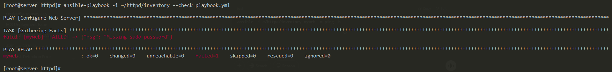
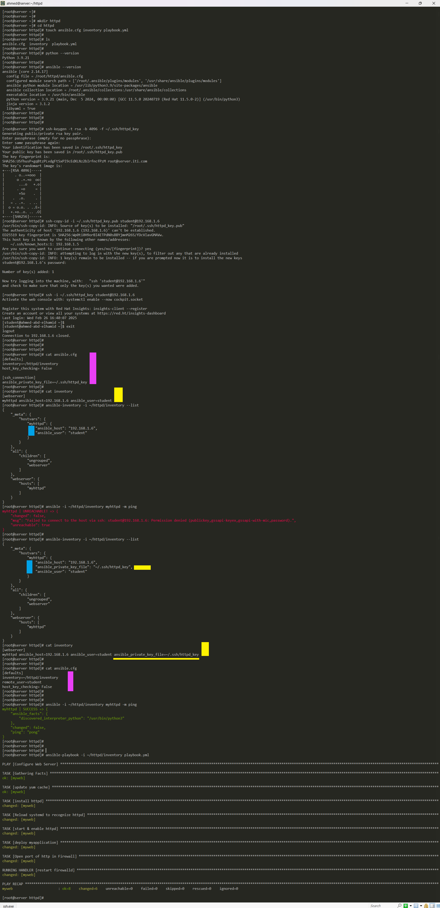
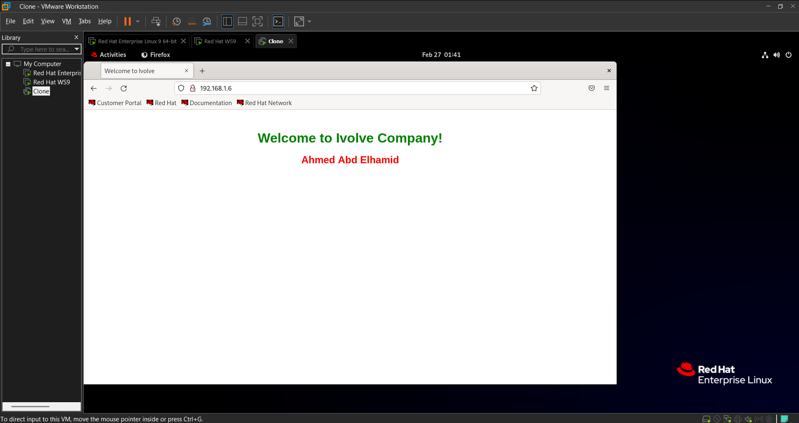

# Lab2
## Architecture


# Check that python & ansible installed
```bash
python --version
ansible --version
```

# Configur SSH
```bash
# Create Key-Pair
ssh-keygen -t rsa -b 4096 -f ~/.ssh/httpd_key

# Copy Public-Key to Remote Machine
ssh-copy-id -i ~/.ssh/httpd_key.pub student@192.168.1.6

# Test Connection
ssh -i ~/.ssh/httpd_key student@192.168.1.6

```


# Configure Ansible [ansible.cfg, inventory, playbook.yml, index.html]
```bash
mkdir httpd
cd httpd
touch ansible.cfg inventory playbook.yml index.html

----------------------------------------------
# Default Configuration File
vim ansible.cfg

[defaults]
inventory=~/httpd/inventory
remote_user=student
host_key_checking= False

# Missing sudo password
# Give User "Root Permissions"
# to {install httpd}
[privilege_escalation]
become=True
become_method=sudo
become_user=root
----------------------------------------------
-----------------------------------------------------------------------------------------------------
# Include IPs
vim inventory
[webserver]
myweb ansible_host=192.168.1.6 ansible_user=student
-----------------------------------------------------------------------------------------------------
```

# Firstlt Check Connection "before move to playbook.yml"
```bash
ansible-inventory -i ~/httpd/inventory --list
ansible -i ~/httpd/inventory myweb -m ping
```

# Configure Ansible [playbook.yml]
```bash
---
- name: Configure Web Server
  hosts: myweb
  remote_user: student
  become: true
  tasks:
    - name: update yum cache
      yum:
        update_cache: yes

    - name: install httpd
      yum:
        name: httpd
        state: present

    - name: Reload systemd to recognize httpd
      command: systemctl daemon-reload
      when: ansible_os_family == "RedHat"

    - name: start & enable httpd
      service:
        name: httpd
        state: started
        enabled: true

    - name: deploy myapplication
      copy:
        src: index.html
        dest: /var/www/html/index.html

    - name: Open port of http in Firewall
      firewalld:
        service: http
        permanent: true
        state: enabled
      notify:  restart firewalld

  handlers:
    - name: restart firewalld
      service:
        name: firewalld
        state: reloaded
```


# Check Code before Run
```bash
# Check Syntax "if there is any Errors"
ansible-playbook -i ~/httpd/inventory --syntax-check playbook.yml

# Run "Playbook" without make any actual changes on the Hosts
ansible-playbook -i ~/httpd/inventory --check playbook.yml
```

# Errors that faced me and how i solved it
```bash
# Ansible can't find firewalld
ansible-galaxy collection install ansible.posix

# [Update Ansible] to compatible with "ansible.posix"
pip install --upgrade ansible

# Missing sudo password
# Give User "Root Permissions"
[privilege_escalation]
become=True
become_method=sudo
become_user=root
```

## Although i write this instructions but [Missing sudo password] too


```bash
ssh student@192.168.1.6
su

vim /etc/sudoers.d/student
student ALL=(ALL) NOPASSWD: ALL
```
# Steps


# Web Page Output

