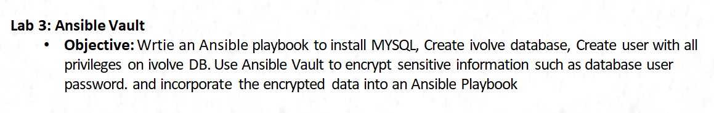
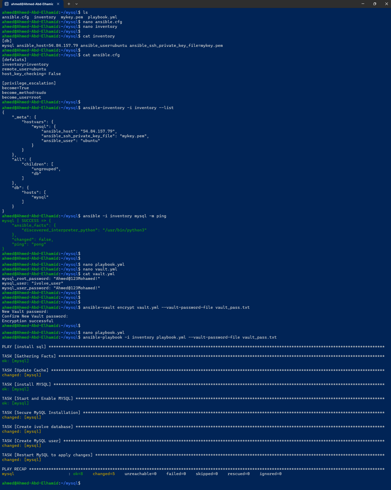
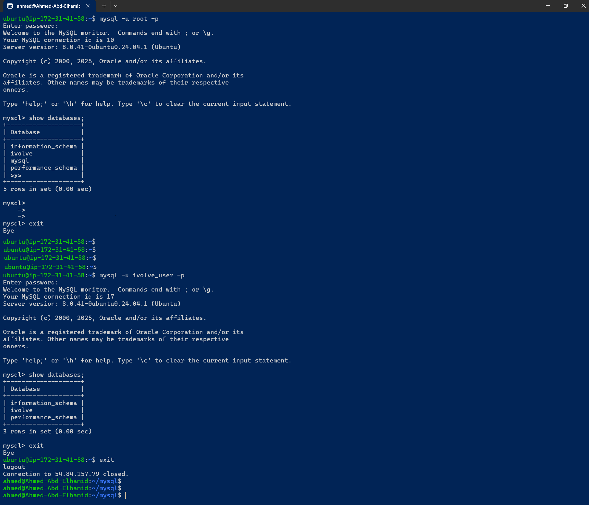

# Lab3
## Architecture



# Running on Debian from MY-PC

# Check that python & ansible installed
```bash
python3 --version
ansible --version
```

# Create EC2-Instance
```bash

# Change Persission to be Read Only
chmod 0400 mykey.pem

# Connect to EC2
ssh -i mykey.pem ubuntu@54.84.157.79
```

# Configure Ansible [ansible.cfg, inventory, playbook.yml]
```bash
mkdir mysql
cd mysql
touch ansible.cfg inventory playbook.yml mykey.pem
----------------------------------------------
# Default Configuration File
vim ansible.cfg

[defaults]
inventory=inventory
remote_user=ubuntu
host_key_checking= False

# Missing sudo password
# Give User "Root Permissions"
# to {install httpd}
[privilege_escalation]
become=True
become_method=sudo
become_user=root
----------------------------------------------
-----------------------------------------------------------------------------------------------------
# Include IPs
vim inventory
[db]
mysql ansible_host=54.84.157.79 ansible_user=ubuntu ansible_ssh_private_key_file=mykey.pem
-----------------------------------------------------------------------------------------------------
```

# Firstly Check Connection "before move to playbook.yml"
```bash
# List Inventory
ansible-inventory -i inventory --list
# Ping on Server to ensure it can connect with it
ansible -i inventory mysql -m ping

# For necessity Only!!!!!!!!!!
ansible -i inventory mysql -m ping --key-file=mykey.pem -u ubuntu
```

# Create ansible-valut
```bash
nano vault.yml

-------------------------------------------
mysql_root_password: "Ahmed@123Mohamed!"
mysql_user: "ivolve_user"
mysql_user_password: "Ahmed@123Mohamed!"
-------------------------------------------
```
# if you want to enter password manually or automatically
```bash
# Manually
----------------------------------------------------------------------
# to Encrypt File & # Will ask ypu to Enter Password!!!!!!!!!!!!!!
ansible-valut encrypt vault.yml
ansible-playbook -i inventory playbook.yml --ask-valut-pass
----------------------------------------------------------------------

# automatically
-----------------------------------------------------------------------------
# Not Upload it to Github
echo "Your-Pass" > vault_pass.txt

ansible-vault encrypt vault.yml --vault-password-file vault_pass.txt

ansible-playbook -i inventory playbook.yml --vault-password-file vault_pass.txt
-----------------------------------------------------------------------------
```

# Prepare Playbook to install MYSQL
```bash

nano playbook.yml

---
- name: install sql
  hosts: mysql
  become: true
  vars_files:
  - vault.yml

  tasks:

  - name: Update Cache
    apt:
      update_cache: yes

  - name: install MYSQL
    apt:
      name:
      -  mysql-server
      -  python3-pymysql
      state: present

  - name: Start and Enable MYSQL
    service:
      name: mysql
      state: started
      enabled: yes

  - name: Secure MySQL Installation
    mysql_user:
      login_user: root
      login_password: "{{ mysql_root_password }}"
      login_unix_socket: /var/run/mysqld/mysqld.sock
      user: root
      password: "{{ mysql_root_password }}"
      host: localhost
    ignore_errors: yes

  - name: Create ivolve database
    mysql_db:
      name: ivolve
      state: present
      login_user: root
      login_password: "{{ mysql_root_password }}"

  - name: Create MySQL user
    mysql_user:
      name: "{{ mysql_user }}"
      password: "{{ mysql_user_password }}"
      priv: "ivolve.*:ALL"
      host: "%"
      state: present
      login_user: root
      login_password: "{{ mysql_root_password }}"

  - name: Restart MySQL to apply changes
    service:
      name: mysql
      state: restarted
```


# Check Code before Run
```bash
# Check Syntax "if there is any Errors"
ansible-playbook -i inventory --syntax-check playbook.yml --ask-vault-pass

# Run "Playbook" without make any actual changes on the Hosts
ansible-playbook -i inventory --check playbook.yml --ask-vault-pass
```

# Run on Production
```bash
ansible-playbook -i inventory playbook.yml --ask-vault-pass

ansible-playbook -i inventory playbook.yml --vault-password-file vault_pass.txt
```

# Steps



# Outputs
