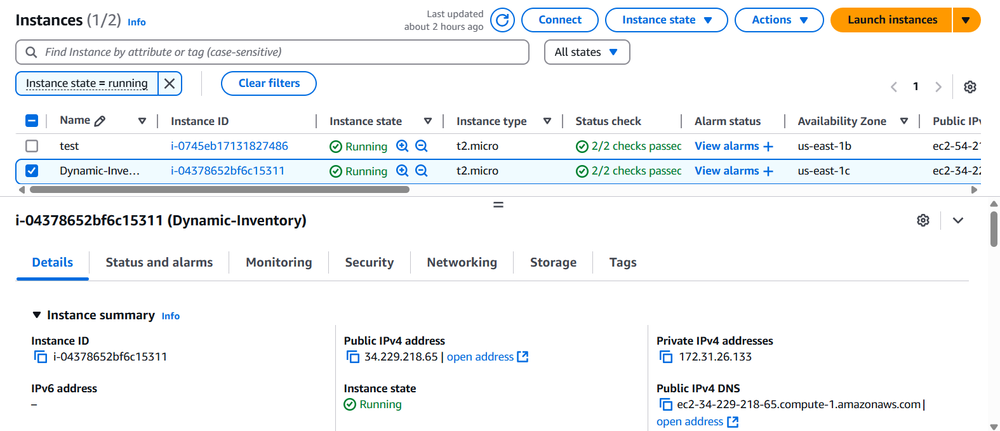
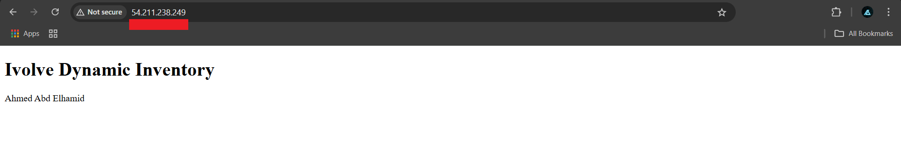
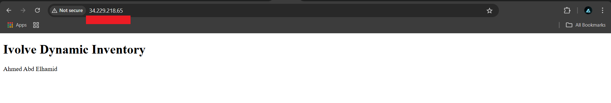

# Lab 5: Ansible Dynamic Inventory with AWS EC2


## Overview
This lab demonstrates how to use Ansible with a dynamic inventory to manage AWS EC2 instances. You will:
- Create EC2 instances.
- Configure Ansible to interact with AWS.
- Use dynamic inventory to fetch running EC2 instances.
- Run Ansible playbooks against the discovered inventory.

---

## 🏗️ Infrastructure Setup

### EC2 Instances
- **Two EC2 Instances** created with a single **shared private key** (`ansible.pem`).
- Security Group configured to allow:
  - **SSH (port 22)**
  - **HTTP (port 80)**



---

## ⚙️ Prerequisites

### Install AWS CLI (Debian-based Systems)
```bash
sudo apt update && sudo apt upgrade -y
sudo apt install unzip curl -y
curl "https://awscli.amazonaws.com/awscli-exe-linux-x86_64.zip" -o "awscliv2.zip"
unzip awscliv2.zip
sudo ./aws/install
aws --version  # Verify
```

### Configure AWS Credentials
```bash
aws configure
```
Provide your:
- AWS Access Key ID
- AWS Secret Access Key
- Default region (e.g., us-east-1)

### Install Boto3 (for Ansible AWS integration)
```bash
sudo apt install python3-boto3
# Or: pip install boto3 --break-system-packages
```

---

## 🔌 Ansible AWS Plugin Setup

### Install AWS Collection
```bash
ansible-galaxy collection install community.aws
```

### Verify Installed Collections
```bash
ansible-galaxy collection list
```

### Create Inventory and Config Files
```bash
touch aws_ec2.yml    # Inventory file
touch ansible.cfg    # Configuration file
touch Playbook.yml    # Playbook file
```

#### `ansible.cfg` Sample
```ini
[defaults]
inventory = aws_ec2.yml
remote_user = ec2-user
host_key_checking = false
private_key_file = ~/.ssh/ansible.pem

[privilege_escalation]
become = true
become_method = sudo
become_user = root
```

#### `aws_ec2.yml` Sample
```yaml
plugin: amazon.aws.aws_ec2
regions:
  - us-east-1
keyed_groups:
  - key: tags.Name
    prefix: name
filters:
  instance-state-name: running
# hostnames:
#   - public_ip_address
# strict: False
```

---

## 📦 Initialize Ansible Role
```bash
ansible-galaxy role init role
# Clean up unnecessary folders and files as needed
```

---

## ✅ Testing & Execution

### Inventory Checks
```bash
ansible-inventory -i aws_ec2.yml --list
ansible-inventory -i aws_ec2.yml --graph
```

### Syntax Check
```bash
ansible-playbook -i aws_ec2.yml playbook.yml --syntax-check
```

### Dry Run (Check Mode)
```bash
ansible-playbook -i aws_ec2.yml playbook.yml --check
```

### Run in Production
```bash
ansible-playbook -i aws_ec2.yml playbook.yml
```

---

## 📂 Sample Playbook
```yaml
---
- name: Dynamic Inventory
  hosts: all
  remote_user: ec2-user
  become: true
  vars:
    ansible_ssh_private_key_file: ~/.ssh/ansible.pem

  pre_tasks:
    - name: Update DNF cache
      dnf:
        update_cache: true

  roles:
    - role: role
```

---

## 📤 Outputs




---

## 📎 Notes
- Ensure your private key `ansible.pem` has proper permissions (`chmod 400 ansible.pem`).
- Make sure Ansible is **not** run from a world-writable directory to avoid configuration warnings.
- EC2 instances must be in the **running** state and publicly accessible.

---

## 🧼 Cleanup
After finishing, remember to terminate your EC2 instances to avoid unnecessary costs:
```bash
aws ec2 terminate-instances --instance-ids <instance-id>
```

---

## 📚 References
- [Ansible AWS EC2 Plugin Documentation](https://docs.ansible.com/ansible/latest/collections/amazon/aws/aws_ec2_inventory.html)
- [AWS CLI Official Docs](https://docs.aws.amazon.com/cli/)
- [boto3 Documentation](https://boto3.amazonaws.com/v1/documentation/api/latest/index.html)

