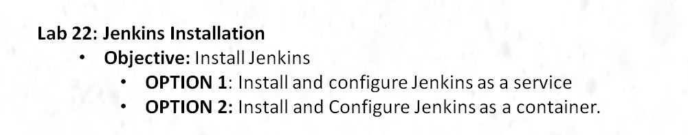
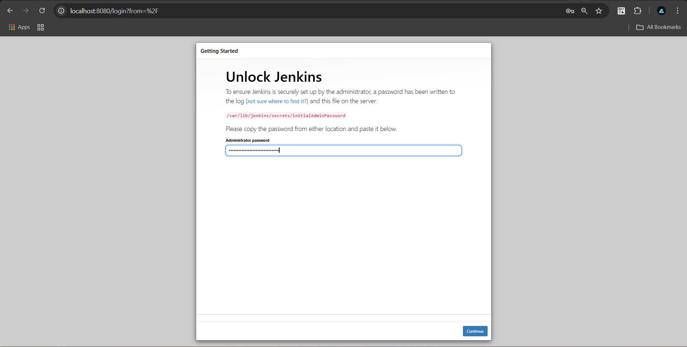
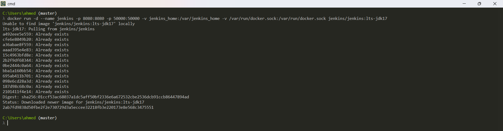
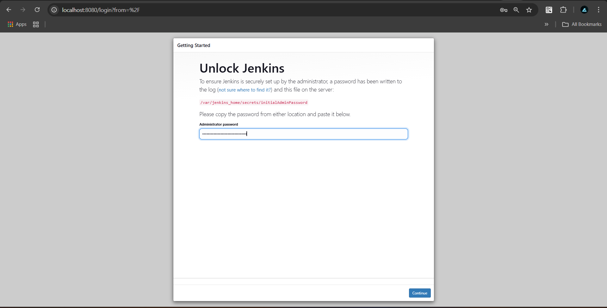

# Lab1


# Install and configure Jenkins as a service

## Step 1:  Install Java on Debian
```bash
sudo apt update -y
sudo apt install openjdk-17-jdk -y
java -version
```

## Step 2:  Install Jenkins on Debian
```bash
wget -q -O - https://pkg.jenkins.io/debian/jenkins.io.key | sudo apt-key add -
sudo sh -c 'echo deb http://pkg.jenkins.io/debian binary/ > /etc/apt/sources.list.d/jenkins.list'
sudo apt update
sudo apt install jenkins -y

# Enable & Start Jenkins
sudo service jenkins start
sudo service jenkins status

# Retrieve Admin Password
sudo cat /var/lib/jenkins/secrets/initialAdminPassword
```



# Install and Configure Jenkins as a container

## Step 2:  Install Jenkins on Docker Desktop
```bash
# -v jenkins_home  ---->  Persistent Jenkins Data
# -v /var/run/docker.sock ---->  allows Jenkins to interact with Docker on the host machine
docker run -d --name jenkins -p 8080:8080 -p 50000:50000 -v jenkins_home:/var/jenkins_home -v /var/run/docker.sock:/var/run/docker.sock jenkins/jenkins:lts-jdk17

# Retrieve Admin Password
docker exec jenkins cat /var/jenkins_home/secrets/initialAdminPassword
```


