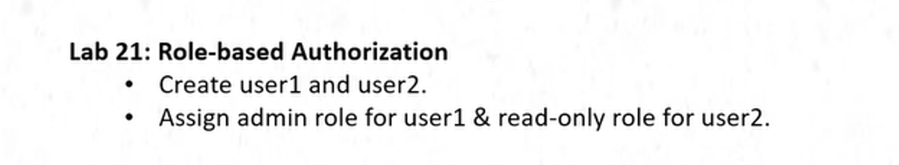
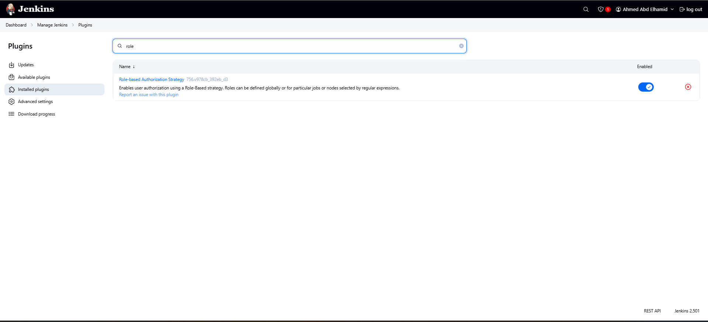
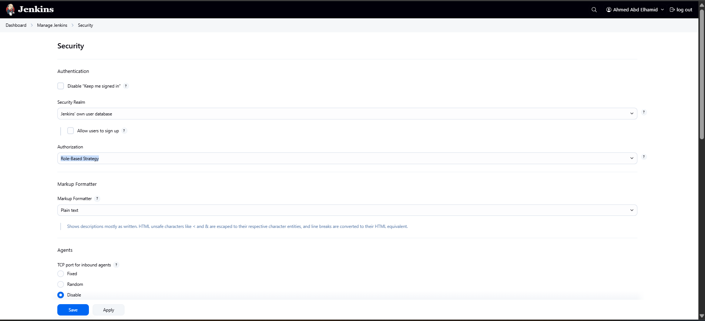
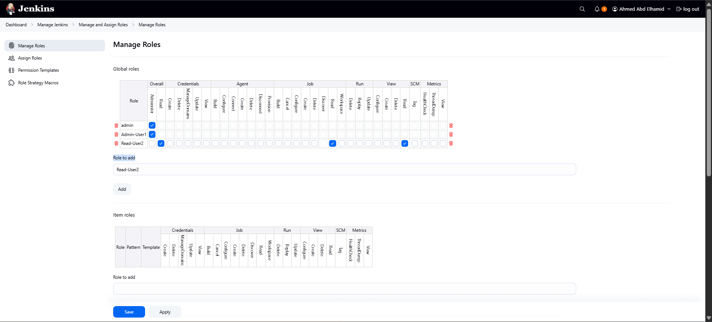
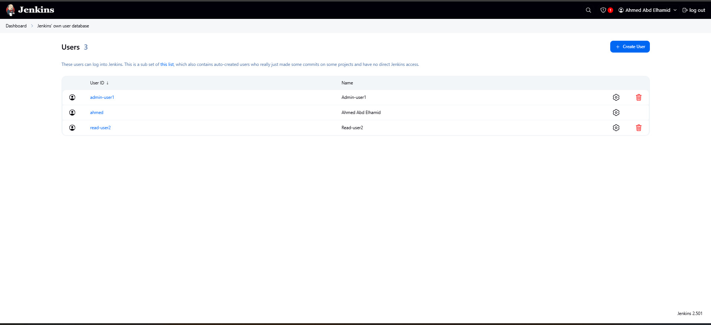
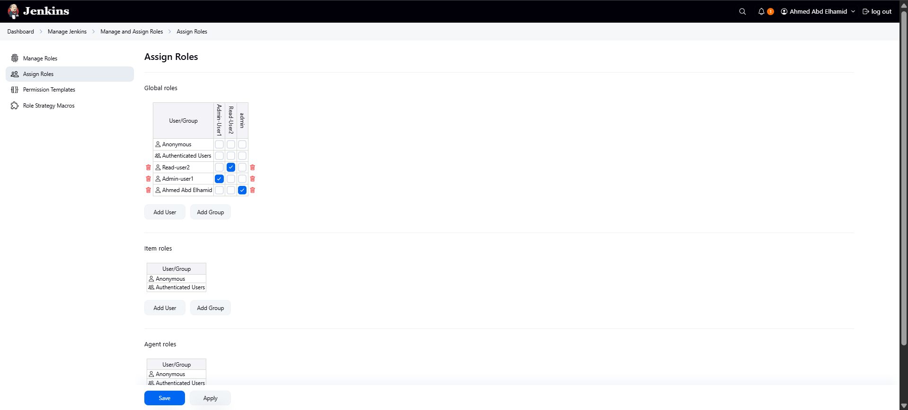
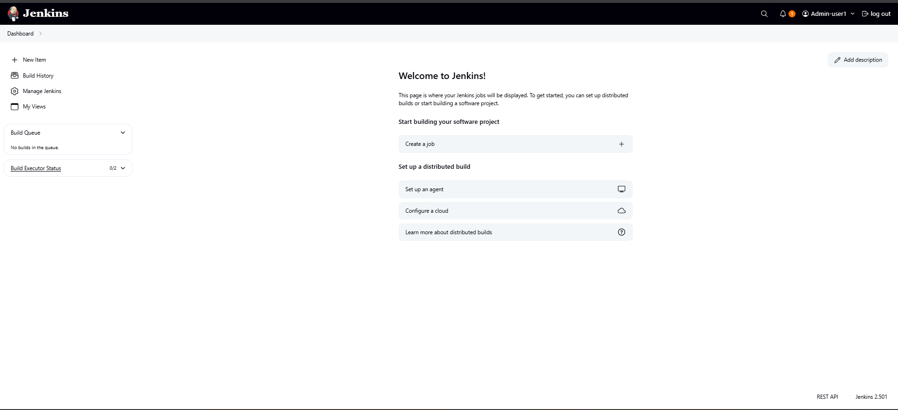
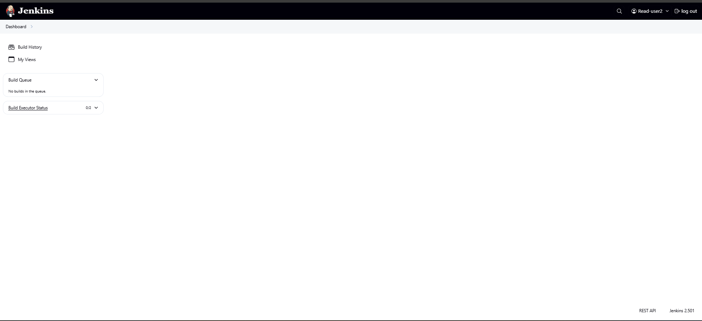

# Lab1


# Add Role Plugin
```bash
From Manage Jenkins  --->  Plugins  --->  Available Plugins  --->  Role-based Authorization Strategy
```


# Configure Role-based Authorization Strategy
```bash
From Manage Jenkins  --->  Security  --->  Authorization(Role-Based Strategy)  --->  Save
```


# Create Roles
```bash
From Manage Jenkins  --->  Manage and Assign Roles  ---> 
Manage Roles  --->  Role to add(Add-Name of Role)  then Click Add  ---> Save
```


# Create 2 Users
```bash
From Manage Jenkins --->  Users  ---> Create User
```


# Assign Role for Users
```bash
From Manage Jenkins  --->  Manage and Assign Roles  ---> 
Assign Roles  --->  Global Role (Add User-ID)  then Click OK  ---> Save
```


# Change Password for Users
```bash
From Manage Jenkins --->  Users  --->  Choose Your user to(Configure your Password)  ---> Security  ---> Password
```

# Test Enters by 2 Users


