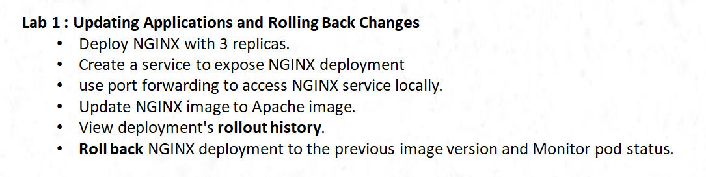
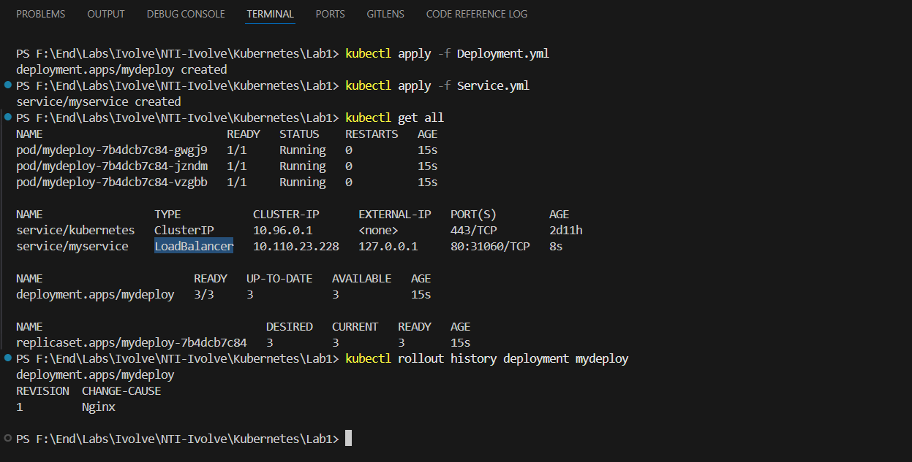
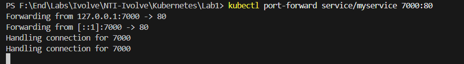
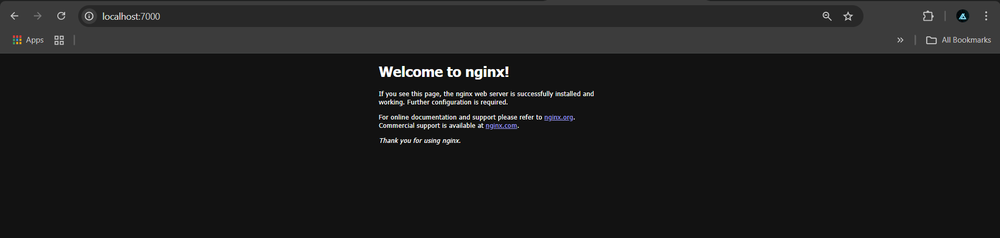
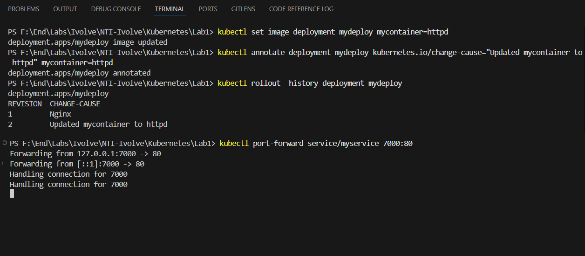
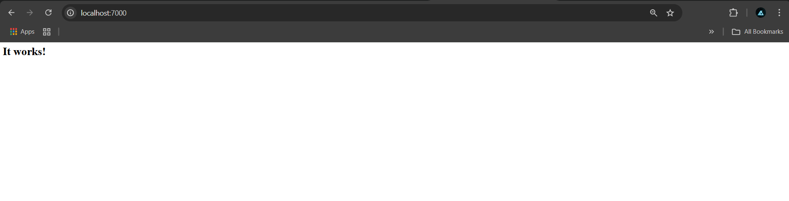
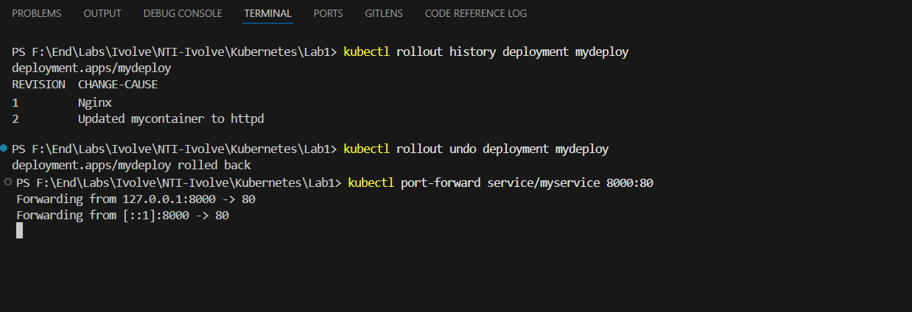
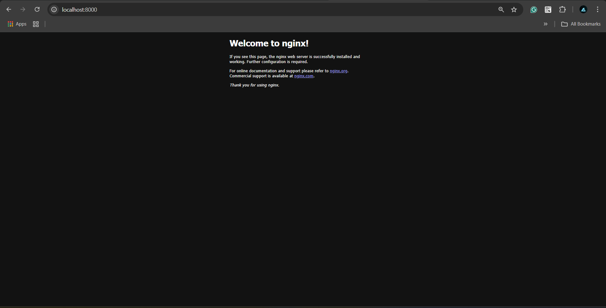

# Lab1


# Prepare 2 Manifest file for Deploy & Service

# Apply 2 Manifest file
```bash
kubectl apply -f Deployment.yml
kubectl apply -f Service.yml

# To Run Service as LoadBalancer run this Command in new terminal
minikube tunnel
```


# Port Forward to Access Nginx




# Update Nginx to Apache
```bash
# Don't run this Command until you find thet there is Deploymnet running
kubectl set image deployment mydeploy mycontainer=httpd

# Add annotations to distinct it
kubectl annotate deployment mydeploy kubernetes.io/change-cause="Updated mycontainer to httpd"

```



# Rollback
```bash
# Display All Versions on Images
kubectl rollout history deployment mydeploy

# Rollback
kubectl rollout undo deployment mydeploy  

# Forward Nginx
 kubectl port-forward service/myservice 8000:80
 ```


