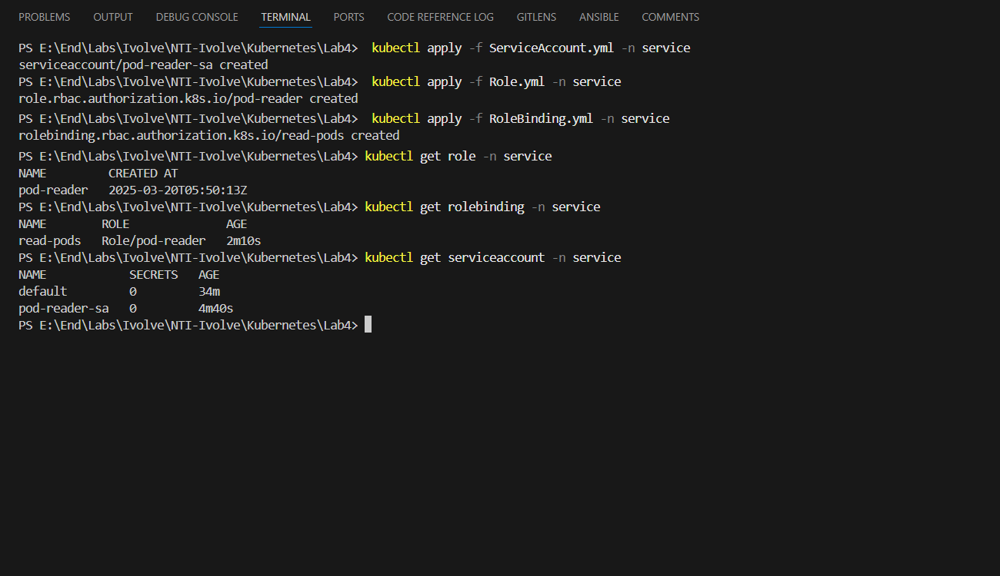

# Lab4: Kubernetes RBAC and ServiceAccount Token

This guide covers creating a Kubernetes **Namespace**, applying **RBAC roles**, and generating a **ServiceAccount token** for secure access.

---


## 🌟 Architecture Overview

# Step1: Create NameSpace
```bash
kubectl create namespace service
kubectl get namespace service 
```


# Step2: Apply Roles
```bash
# Apply all
 kubectl apply -f ServiceAccount.yml -n service
 kubectl apply -f Role.yml -n service
 kubectl apply -f RoleBinding.yml -n service

 # Display all
 kubectl get role -n service
 kubectl get rolebinding -n service
 kubectl get serviceaccount -n service
```


# Step3: Create & Display ServiceAccount Token
```bash
# Create ServiceAccount Token
kubectl create token pod-reader-sa --namespace service
# Test Authorization
 kubectl auth can-i list pods -n service --as=system:serviceaccount:service:pod-reader-sa

 kubectl auth can-i create pods -n service --as=system:serviceaccount:service:pod-reader-sa
 ```


# Step4: Comparing
