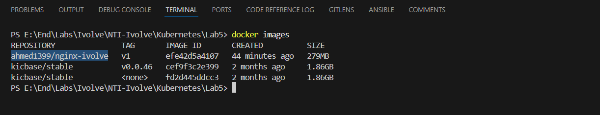
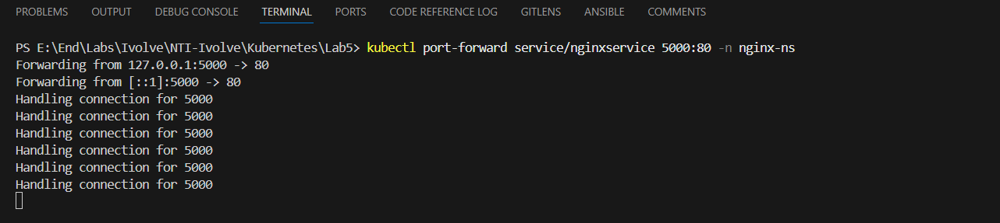

# Lab5


# Step1: Build Nginx-Image
```bash
cd <Dockerfile-Path>

# Build & Tag Image
docker build -t <docker-account>/nginx-ivolve:v1 .

# Push Image
docker push <docker-account>/nginx-ivolve:v1
```



# Step2: Firstly Check Resources of Minikube Node
```bash
kubectl describe node minikube
```


# Step3: Prepare ResourceQuote, NetworkPolicy, Deployment, Service, Ingress
```bash
# create Namespace
kubectl create namespace nginx-ns

# Specify Maximum that will run on Namespace
kubectl apply -f ResourceQuota.yml -n nginx-ns

# Allow Traffic between Pods within only Namespace
kubectl apply -f NetworkPolicy.yml -n nginx-ns

# Apply All
kubectl apply -f Deployment.yml -n nginx-ns
kubectl apply -f Service.yml -n nginx-ns
kubectl apply -f Ingress.yml -n nginx-ns

# Display All
kubectl get all -n nginx-ns
```


## to operate Service of type "LoadBalancer"
```bash
# Open New Terminal & write
minikube tunnel
```

# Step4: list all Services
```bash
kubectl get all -n nginx-ns
```


# Step5: Check if you can run Pod > 5
```bash
# Can't Run another Pod because Limits of Resourc Quota
kubectl run pod test --image ahmed1399/nginx-ivolve:v1 -n nginx-ns
```


# Step6: Test by Port-forward
```bash
kubectl port-forward service/nginxservice 5000:80 -n nginx-ns
```



# Step7: Add Domain Name in /etc/hosts & curl [Domain-Name]
```bash
# get of Ip Address
minikube ip
minikube ssh
 
# Add IP Address & Domain Name
sudo vi /etc/hosts
<IP>   <Domain-Name>

curl <Your Domain Name>
```


# Step8: Test Network Policy
```bash

# if you try to create "pod" in different Namespace and write 
curl -I nginx.ivolve.com  ----->  Can't access to this Domain Name

# if you write this UPL in any pod in the Namespace that they created in ----->  will display APP 
```