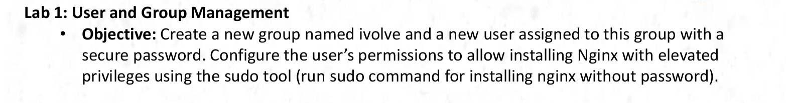
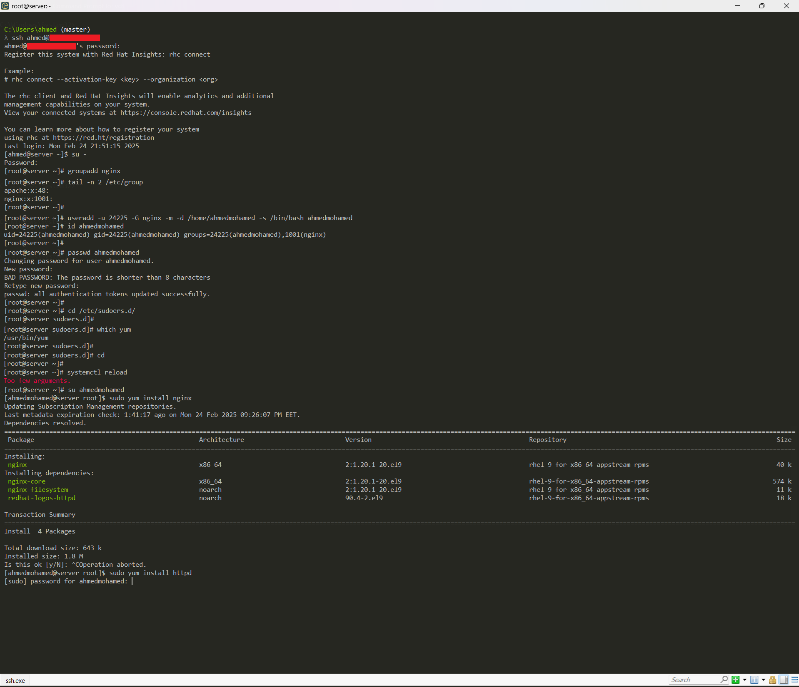
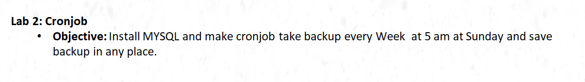
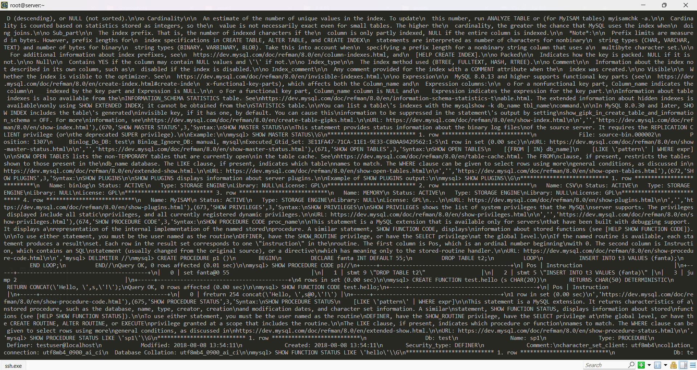
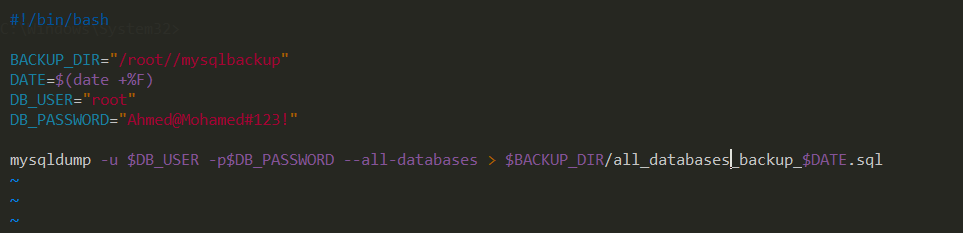
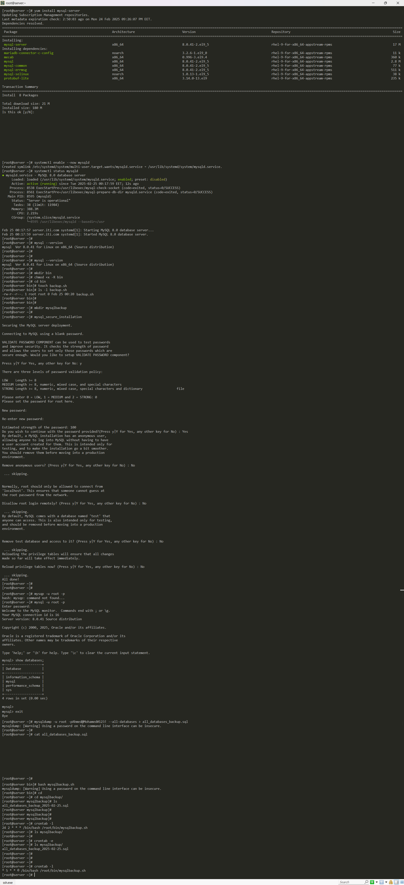

Enter to Your VM

## to get of "IP" & connect with "VM"

hostname -I
ssh User@IP

# Lab1
## Architecture


```bash
# Switch to Root
su -

# Create Group
groupadd nginx

# Create User
useradd -u 24225 -G nginx -md /home/ahmedmohamed -s /bin/bash ahmedmohamed
passwd ahmedmohamed

--------------------------------------------------------------------
# Find path of yum
which yum

# Add Permissions
# Best-practice to add your permission to {/etc/sudoers.d/}
# if any Update happens not affect or delete Permission
vi /etc/sudoers.d/ahmedmohamed

# Add this Permission within ahmedmohamed
ahmedmohamed ALL=(ALL) NOPASSWD: /usr/bin/yum install nginx
--------------------------------------------------------------------

# to apply Changes
systemctl reload

# Switch to ahmedmohamed
su ahmedmohamed

# Install nginx without Password & Require Password when install anything else
sudo yum install nginx

sudo yum install httpd
```
## Lab1

##########################################################################################
##########################################################################################

# Lab2
## Architecture


```bash
# Switch to Root
su -

# Install mysql
yum install mysql-server -y

# Check is mysql installed
mysql --version

# Start & Enable
systemctl enable --now mysqld

# Check Status
systemctl status mysqld
```
--------------------------------------------------------

# Prepare Database & Test Backup before Execute Script by Crontab
```bash
# Create Dir for Backup
mkdir mysqlbackup   

# Create bin for Script
mkdir bin
chmod +x +R bin

# Enter to bin & Check Permission
cd bin

touch mysqlbackup.sh

ls -l
--------------------------------------------------------------
# Assign Password for MYSQL
mysql_secure_installation
Password:  Ahmed@Mohamed#123!

# Check MySQL Password Policy & Display Database
mysql -u root -pAhmed@Mohamed#123!

show databases;
exit
exit
```

# Test [Backup All Databases] before Execute Script
```bash
mysqldump -u root -pAhmed@Mohamed#123! --all-databases > all_databases_backup.sql
```
## Architecture


--------------------------------------------------------------

# Write Script to Execute Backup
```bash
vim mysqlbackup.sh

#!/bin/bash

BACKUP_DIR="/root/mysqlbackup"
DATE=$(date +%F)
DB_USER="root"
DB_PASSWORD="Ahmed@Mohamed#123!"

mysqldump -u $DB_USER -p$DB_PASSWORD --all-databases > $BACKUP_DIR/mysql_backup_$DATE.sql

```
## Script



# Test [Backup All Databases] by Script
```bash
bash mysqlbackup.sh

# Same Output
```

# Finally Ececute Crontab
```bash
# Take backup every Week at 5 am at Sunday and save backup in any place

# to write Cron
crontab -e

M  H  D  D-Mo D-W   Command
*  5  *  *  0 /bin/bash /root/bin/mysqlbackup.sh 

# List Cron
crontab -l
```
## Architecture



