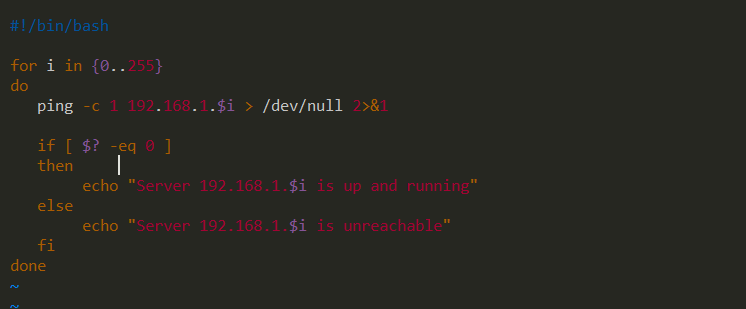

# Lab3
## Architecture


# Write Script to ping on Each Server
```bash

mkdir bin
chmod +x -R bin

cd bin

touch ping.sh
ls -l

# Write Script
vim ping.sh

# Run Script
bash ping.sh

# Display Running Process
ps

# Display Jobs
jobs -l

# to Stop Process
ctr + z

# If you want to kill
kill %Job-ID
```
## Script

```bash

#!/bin/bash

for i in {1..255}
do
    ping -c 1 192.168.1.$i > /dev/null 2>&1
    
    if [ $? -eq 0 ]
    then
        echo "Server 192.168.1.$i is up and running"
    else
        echo "Server 192.168.1.$i is unreachable"
    fi
done


```

## Output
