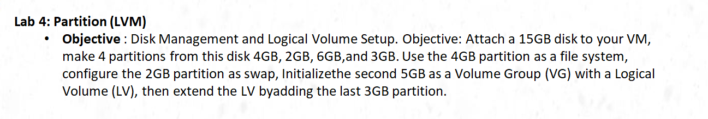
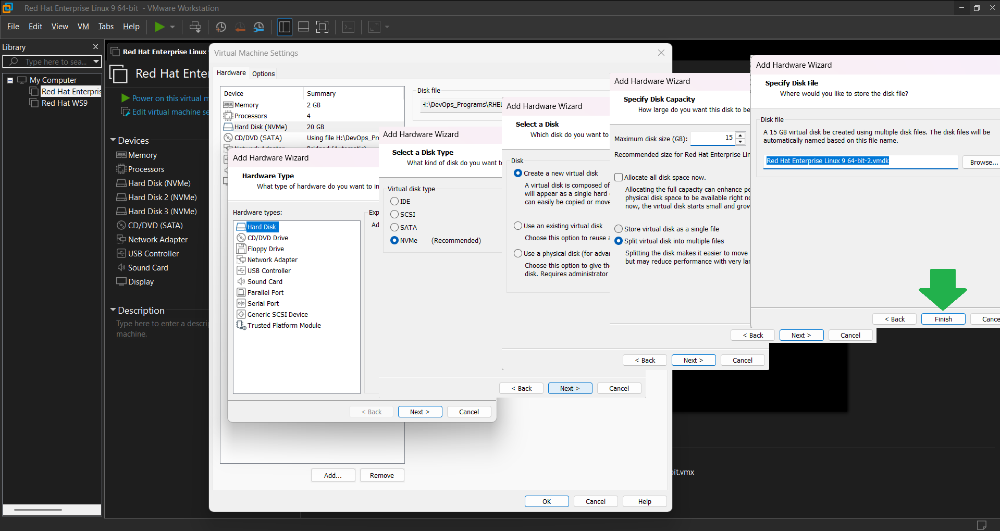
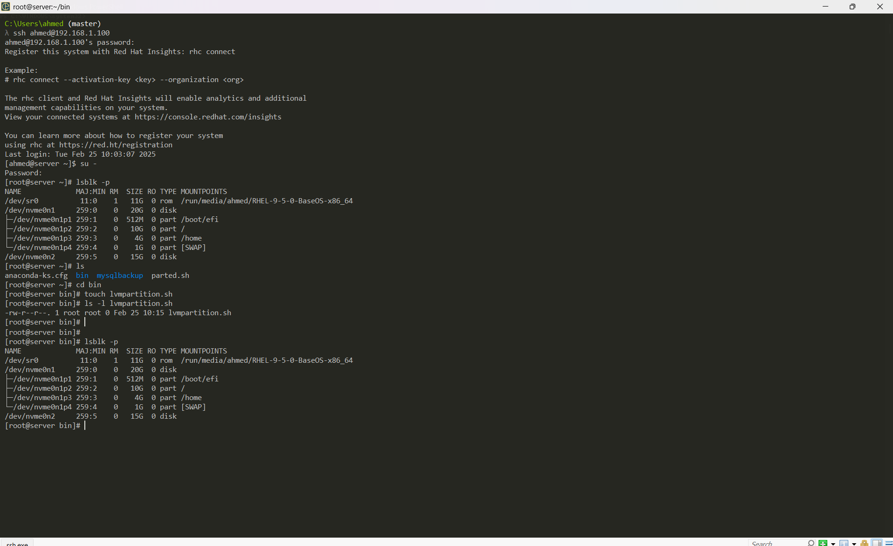
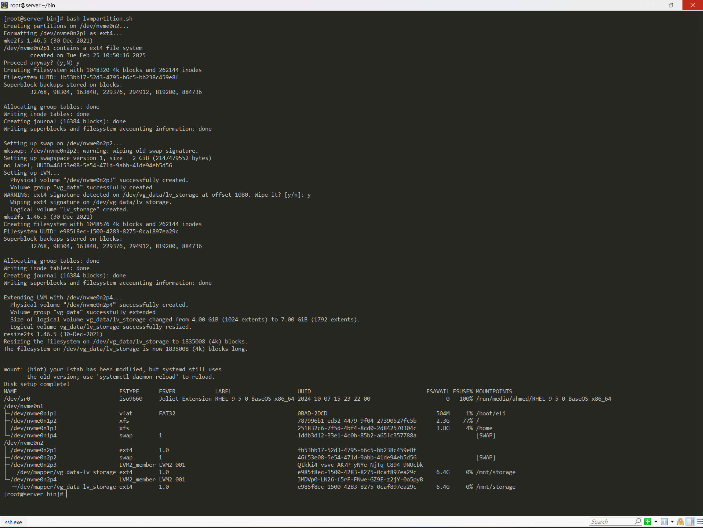
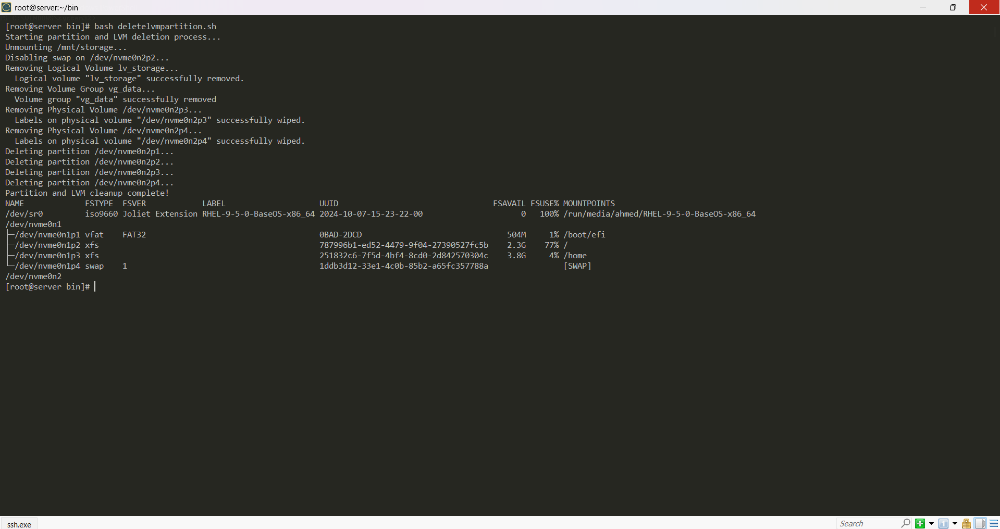

# Lab4
## Architecture


# Create Disk
```bash
# Click on Edit your Virtual Machine

# Add Disk 15GB
```
## Architecture



# Write Script to Partition Disk
```bash

# 1.Enter to your VM

# 2.Display IP Address 
hostname -I

# 3.Connect with VM
ssh User@IP
su -

# Display Disks
lsblk -p

mkdir bin
chmod +x -R bin

cd bin
nano lvmpartiyion.sh
```

## Architecture



# Script to Create LVM ---> nano lvmpartiyion.sh

```bash

#!/bin/bash

# Variables
DISK="/dev/nvme0n2"
PART1="${DISK}p1"  # 4GB
PART2="${DISK}p2"  # 2GB (Swap)
PART3="${DISK}p3"  # 5GB (VG)
PART4="${DISK}p4"  # 3GB (Extend LV)
VG_NAME="vg_data"
LV_NAME="lv_storage"
MOUNT_POINT="/mnt/storage"

# Ensure the disk exists
if [ ! -b "$DISK" ]; then
    echo "Disk $DISK not found. Please check and try again."
    exit 1
fi

# Create partitions using `parted`
echo "Creating partitions on $DISK..."
parted -s "$DISK" mklabel gpt
parted -s "$DISK" mkpart primary ext4 1MiB 4GiB
parted -s "$DISK" mkpart primary linux-swap 4GiB 6GiB
parted -s "$DISK" mkpart primary ext4 6GiB 11GiB
parted -s "$DISK" mkpart primary ext4 11GiB 14GiB

# Refresh partition table and wait for recognition
partprobe "$DISK"
sleep 5

# Verify partitions exist
if [ ! -b "$PART1" ] || [ ! -b "$PART2" ] || [ ! -b "$PART3" ] || [ ! -b "$PART4" ]; then
    echo "Error: Partitions were not created correctly. Exiting..."
    lsblk
    exit 1
fi

# Format 4GB partition as ext4
echo "Formatting $PART1 as ext4..."
mkfs.ext4 "$PART1"

# Configure 2GB partition as swap
echo "Setting up swap on $PART2..."
mkswap "$PART2"
swapon "$PART2"

# Create Volume Group and Logical Volume
echo "Setting up LVM..."
pvcreate "$PART3"
vgcreate "$VG_NAME" "$PART3"
lvcreate -L 4G -n "$LV_NAME" "$VG_NAME"
mkfs.ext4 "/dev/$VG_NAME/$LV_NAME"

# Extend the LV with the last 3GB partition
echo "Extending LVM with $PART4..."
pvcreate "$PART4"
vgextend "$VG_NAME" "$PART4"
lvextend -L +3G "/dev/$VG_NAME/$LV_NAME"
resize2fs "/dev/$VG_NAME/$LV_NAME"

# Mount the LV
mkdir -p "$MOUNT_POINT"
mount "/dev/$VG_NAME/$LV_NAME" "$MOUNT_POINT"
echo "/dev/$VG_NAME/$LV_NAME $MOUNT_POINT ext4 defaults 0 2" >> /etc/fstab

echo "Disk setup complete!"
lsblk -pf
```

## Architecture



# Script to Delete LVM   ---->   nano deletelvmpartiyion.sh

```bash

#!/bin/bash

# Variables
DISK="/dev/nvme0n2"
PART1="${DISK}p1"  # 4GB
PART2="${DISK}p2"  # 2GB (Swap)
PART3="${DISK}p3"  # 5GB (VG)
PART4="${DISK}p4"  # 3GB (Extend LV)
VG_NAME="vg_data"
LV_NAME="lv_storage"
MOUNT_POINT="/mnt/storage"

echo "Starting partition and LVM deletion process..."

# Unmount logical volume
if mountpoint -q "$MOUNT_POINT"; then
    echo "Unmounting $MOUNT_POINT..."
    umount "$MOUNT_POINT"
fi

# Remove entry from /etc/fstab
sed -i "\|/dev/$VG_NAME/$LV_NAME|d" /etc/fstab

# Disable swap
if swapon --show | grep -q "$PART2"; then
    echo "Disabling swap on $PART2..."
    swapoff "$PART2"
fi

# Remove Logical Volume
if lvdisplay "/dev/$VG_NAME/$LV_NAME" &>/dev/null; then
    echo "Removing Logical Volume $LV_NAME..."
    lvremove -y "/dev/$VG_NAME/$LV_NAME"
fi

# Remove Volume Group
if vgdisplay "$VG_NAME" &>/dev/null; then
    echo "Removing Volume Group $VG_NAME..."
    vgremove -y "$VG_NAME"
fi

# Remove Physical Volumes
if pvdisplay "$PART3" &>/dev/null; then
    echo "Removing Physical Volume $PART3..."
    pvremove -y "$PART3"
fi
if pvdisplay "$PART4" &>/dev/null; then
    echo "Removing Physical Volume $PART4..."
    pvremove -y "$PART4"
fi

# Delete partitions
for PART in "$PART1" "$PART2" "$PART3" "$PART4"; do
    if [ -b "$PART" ]; then
        echo "Deleting partition $PART..."
        parted -s "$DISK" rm "$(echo $PART | grep -o '[0-9]*$')"
    fi
done

# Refresh partition table
partprobe "$DISK"

echo "Partition and LVM cleanup complete!"
lsblk -pf
```

## Architecture
