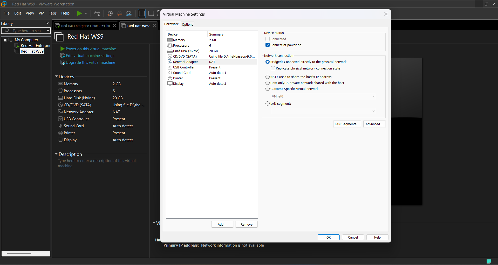
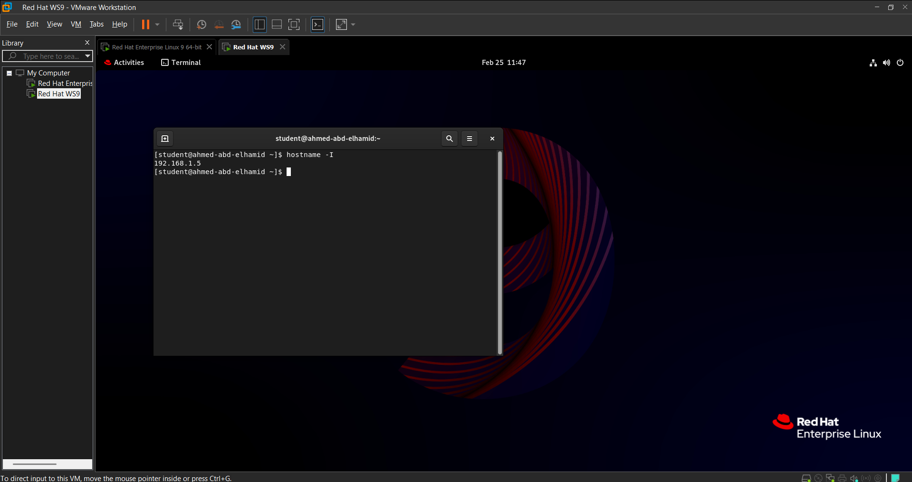
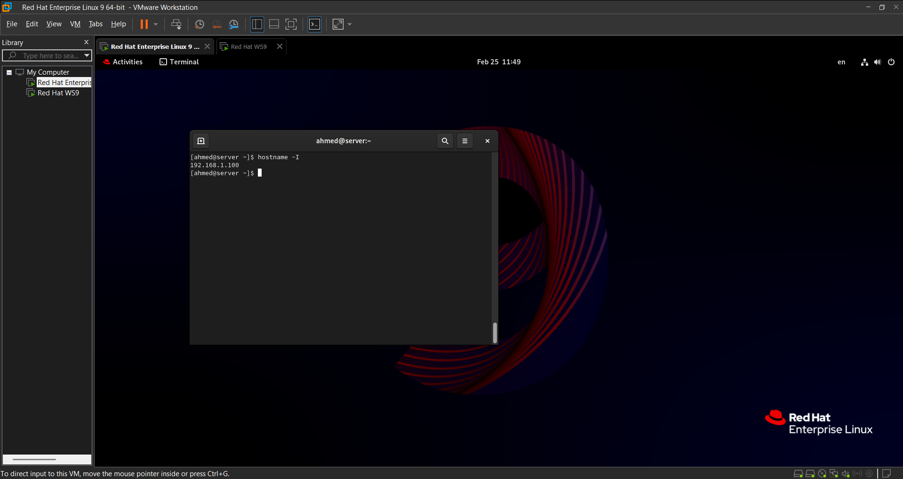
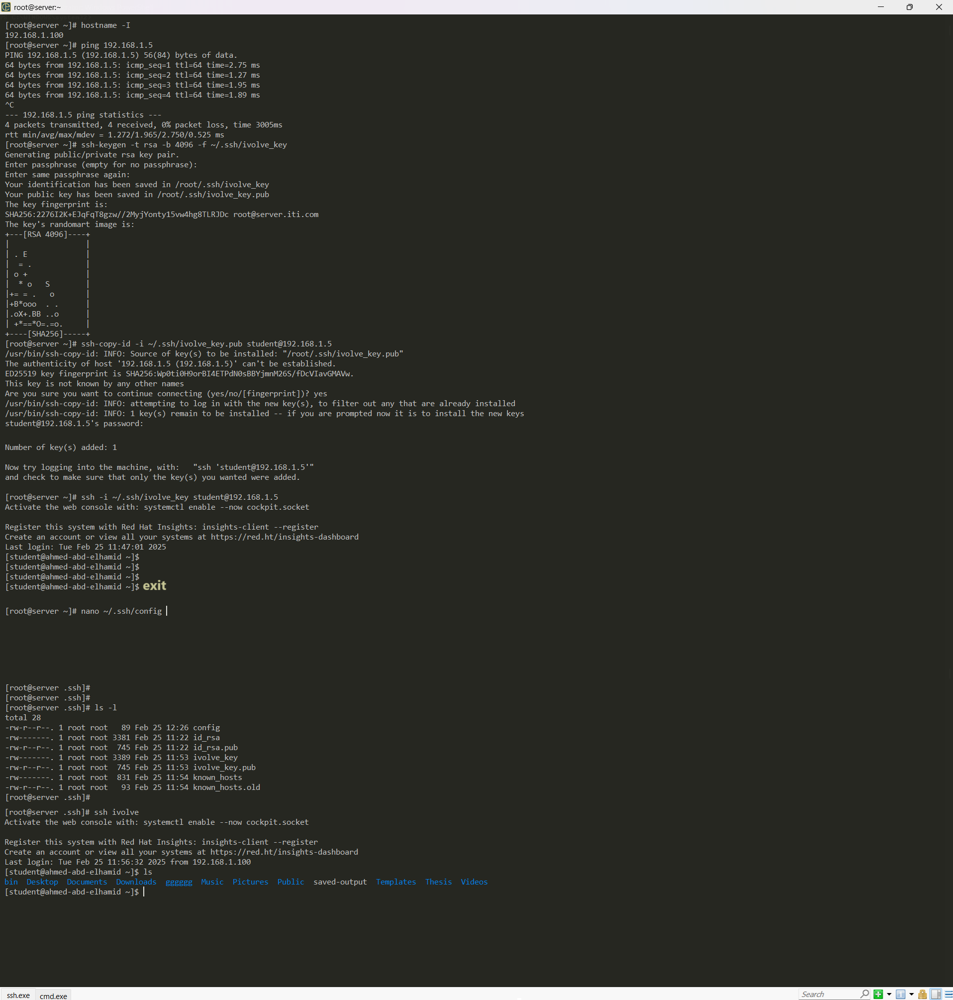

# Lab5
## Architecture


# Open another VM
```bash

# Display {IP Address} of Each VM
# to ensure that 2-VMs in the {same Network}

hostname -I

# Display {IP Address} of your {Local Host}
ipconfig

# they will be as but {x ---> will be different}
192.168.1.x
```
# Two VMs in same Network
## Architecture


# First VM
## Architecture



# Second VM
## Architecture



# Stepts 
```bash

# Display IP of Two VMs
hostname -I

# Ensure that {two VM} can {Ping}
ping 192.168.1.x

# Generate Key-Pair
ssh-keygen -t rsa -b 4096 -f ~/.ssh/ivolve_key

# Copy Public-IP to another VM
ssh-copy-id -i ~/.ssh/ivolve_key.pub student@192.168.1.5

# Ensure that {First VM} can connect to {Second VM}
ssh -i ~/.ssh/ivolve_key student@192.168.1.x
```

# SSH Configure
```bash

# Open the SSH configuration file to {Specific User}
nano ~/.ssh/config

--------------------------------------
Host ivolve
    HostName 192.168.1.x
    User username
    IdentityFile ~/.ssh/ivolve_key
--------------------------------------
# Check on Key-Pair
Private Key: 600
Public key: 644

# Cnnectl with Second VM
ssh ivolve
```

## Architecture
