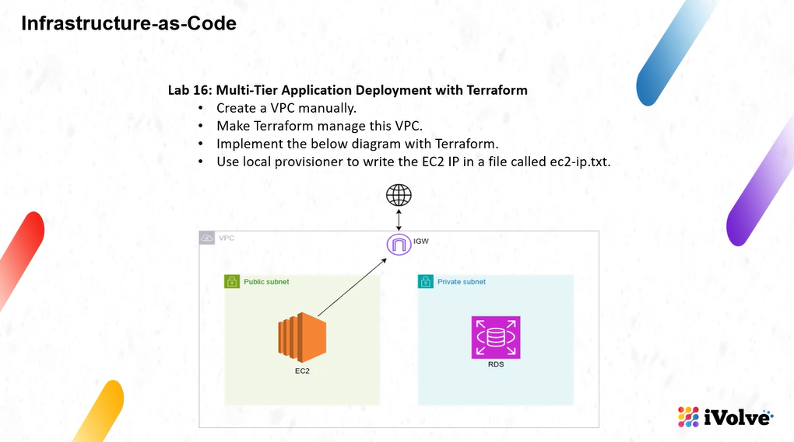
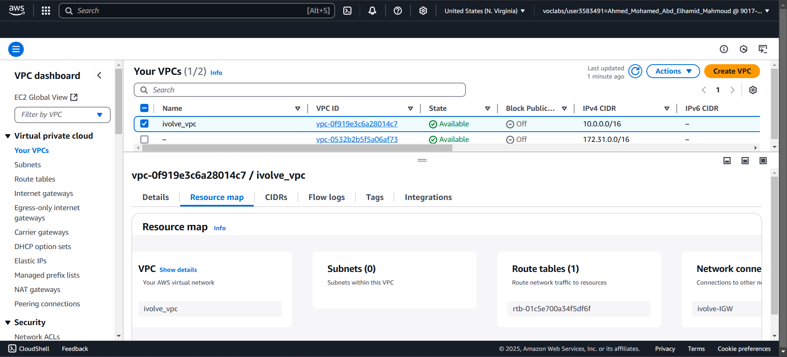
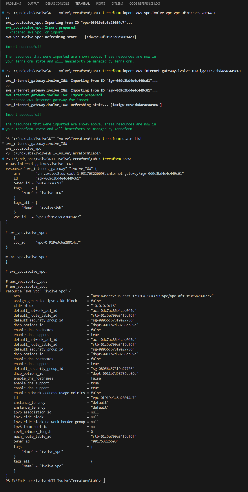
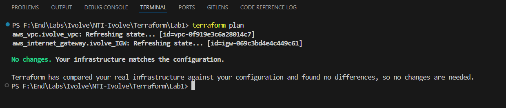
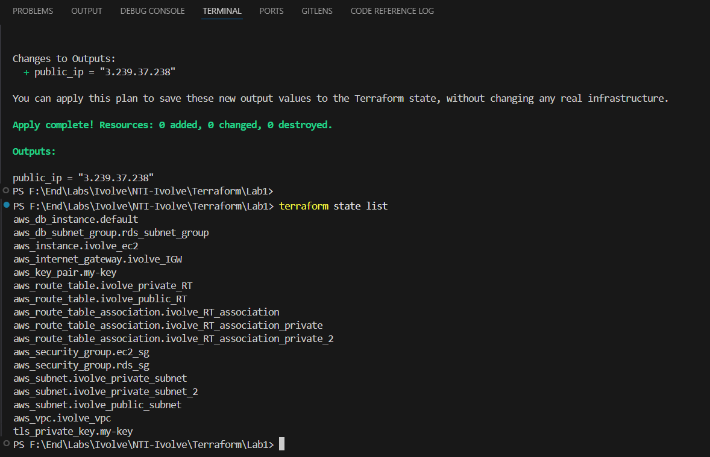
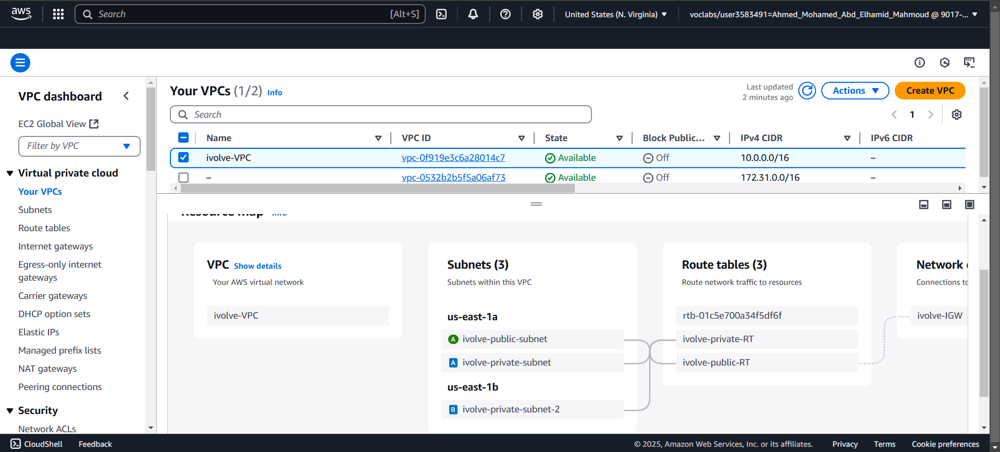
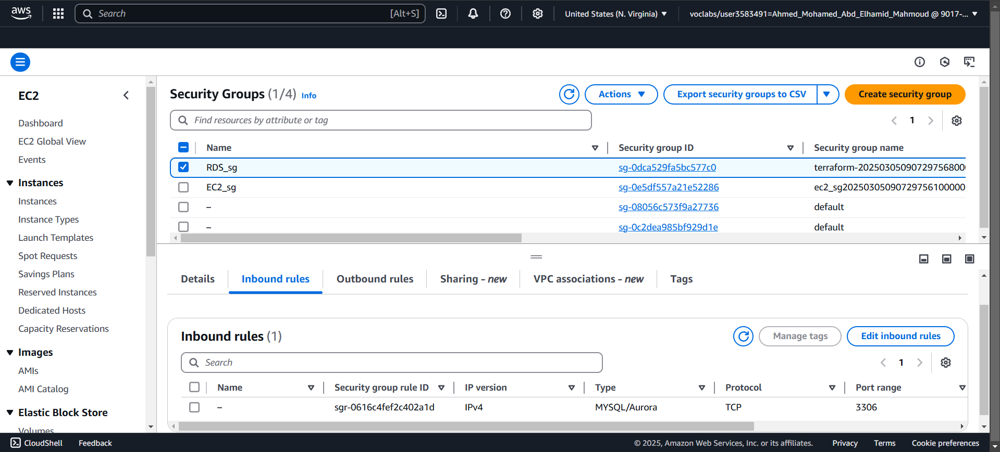
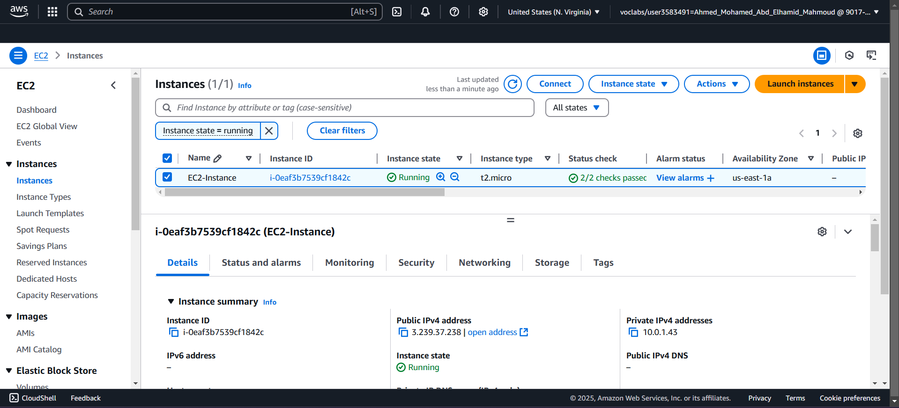
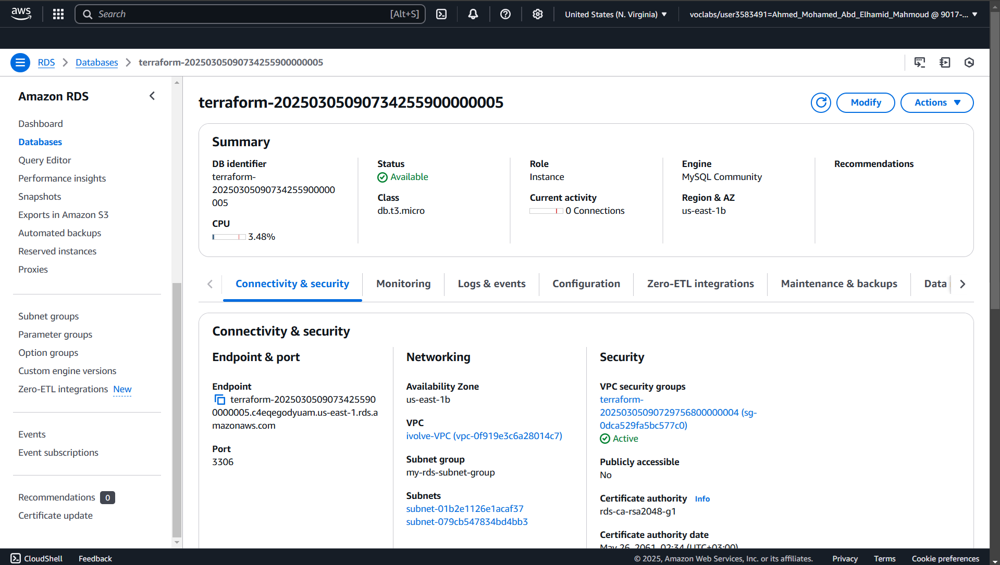

# Lab1



## Create VPC-Manually & Attach IGW to it



# Import VPC
```bash
to import VPC ---> get of VPV-ID

terraform init   ----> Install Plugins

terraform import aws_vpc.ivolve_vpc vpc-0f919e3c6a28014c7
terraform import aws_internet_gateway.ivolve_IGW igw-069c3bd4e4c449c61

terraform state list  ----->  List Resources
terraform show        ----->  Extract Configuration 

```
##



# Check Changes
```bash
After "Extract Configuration" Copy it & add it in "main.tf" then write..

terraform plan    ----->  to ensure that there isn't any changes
```

# Apply
```bash

# Display "every things" that "will be building before building it"
terraform plan

# build Infrastructure
terraform apply -auto-approve

```

##



# Output
##


# VPC-Output
##


# SG-Output
##


# EC2-Output
##


# RDS-Output
##



# Destroy
```bash
# After finished don't forget to destroy infrastructure
terraform destroy -auto-approve
```