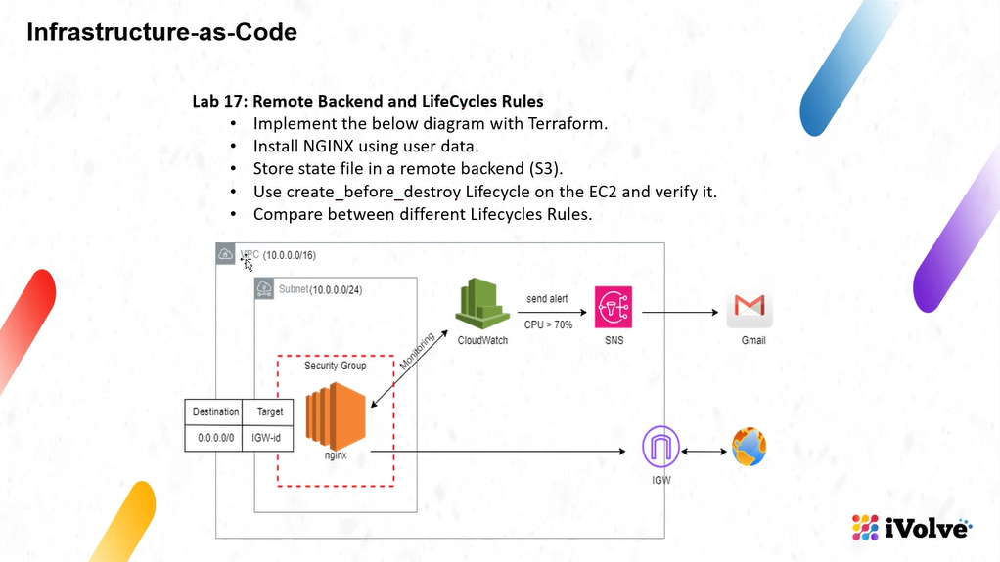
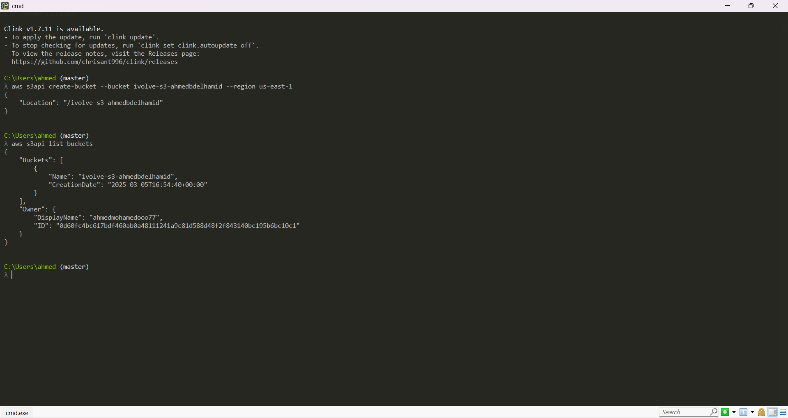
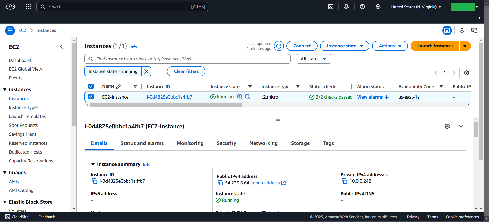
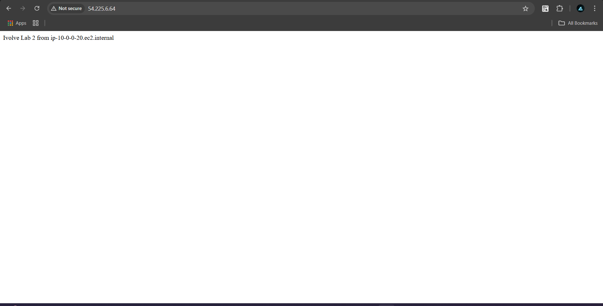
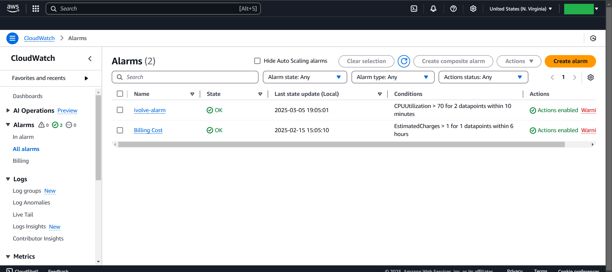
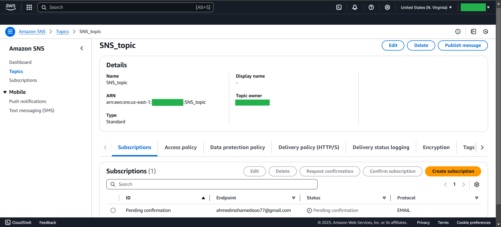
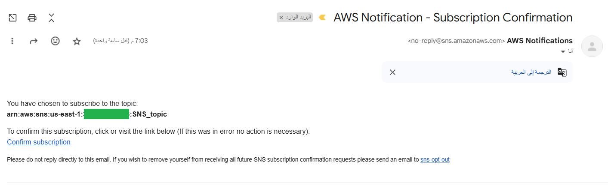

# Lab2



# Create VPC
```bash
VPC_ID      ----->  10.0.0.0/16
Subnet_ID   ----->  10.0.0.0/24
IGW
Route_Table
```

# Create S3-Bucket by CLI
```bash
aws s3api create-bucket --bucket ivolve-s3-ahmedbdelhamid --region us-east-1

After ----->  terraform apply -auto-approve
terraform.tfstate  ---->  will be created in "S3 Bucket"
```

## After Apply 


# Important $$$
```bash
After
terraform init ----->

Apply these Commands consequently to check you Code 

terraform fmt
terraform validate
terraform plan
```

# EC2 Lifecycle
```bash

    # Terraform [creates a new EC2 instance]...before [destroys the old instance].
    lifecycle {
      create_before_destroy = true
   }

   # Prevents accidental deletion of a resource.
   lifecycle {
     prevent_destroy = true
  }

  # Ignores updates to [specific attributes]
  # Ignore AMI updates even if you [update Manually] after you write ---> terraform apply
  lifecycle {
    ignore_changes = [ami]
  }

  # Forces a [resource to be recreated] when [another resource changes]
  # Auto-replace EC2 on IAM role update 
  lifecycle {
    replace_triggered_by = [aws_iam_role.role]
  }

```

# Create EC2
```bash
EC2_Instance
SGs
attach to Subnet
```




# Create CloudWatch to monitor EC2
```bash
When CPUUtilization > 70% CloudWatch will send alert to SNS
```


# Create SNS
```bash
Status (Pending)  ----->  When CPUUtilization > 70% CloudWatch will send alert to SNS & SNS will sent message to "Email"
```




# Destroy
```bash
# After finished don't forget to destroy infrastructure
terraform destroy -auto-approve
```