# Lab3
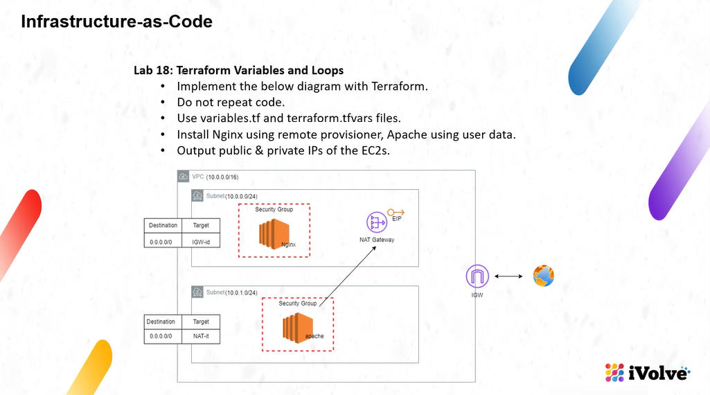

# Checking
```bash
terraform init
terraform fmt
terraform validate
terraform plan
terraform apply -auto-approve
```

# Apply
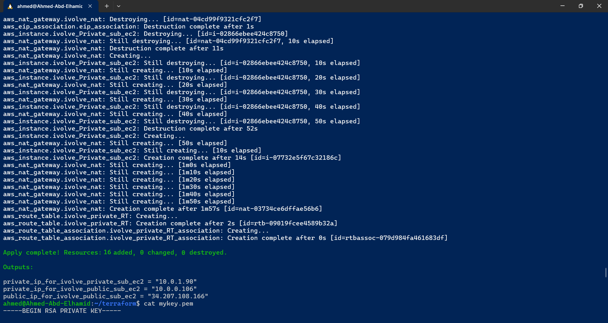

# VPC
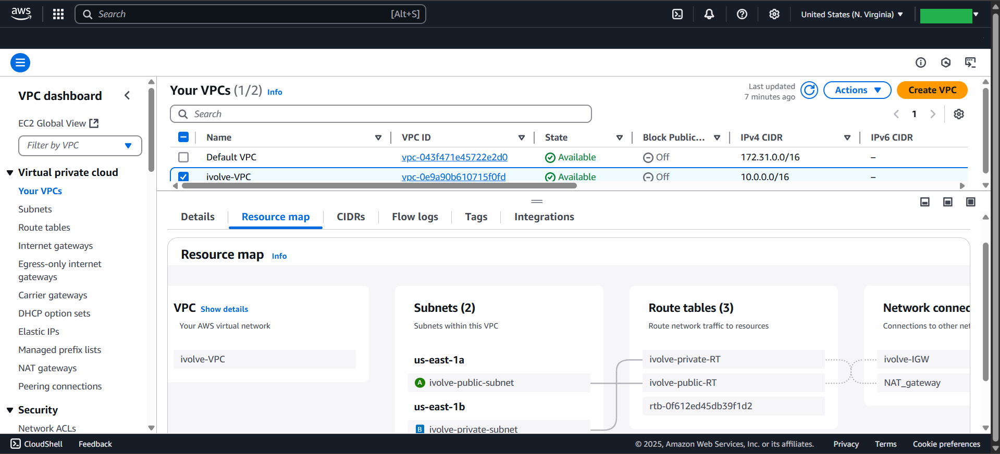

# Subnet
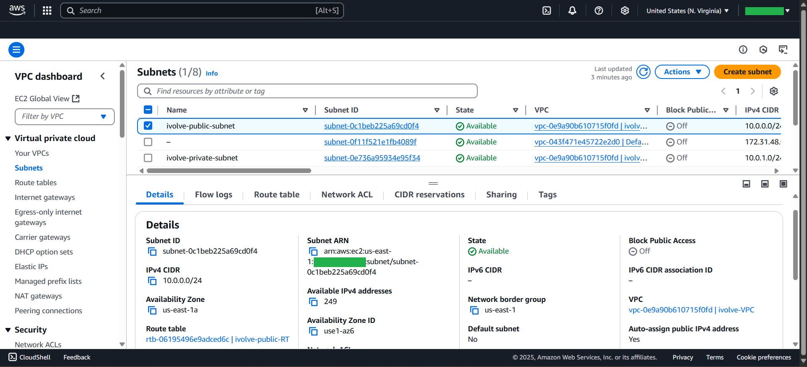
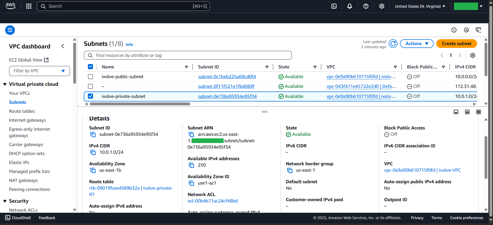

# Route Table IGW & NAT
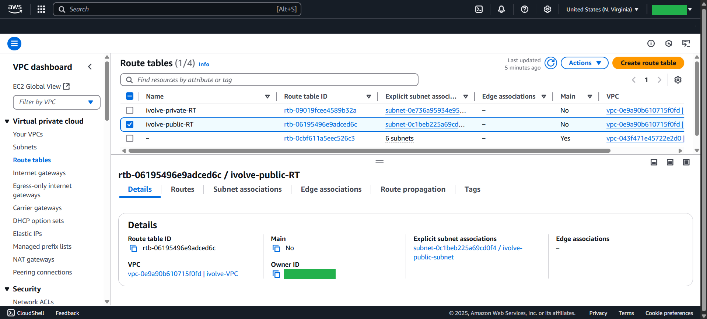
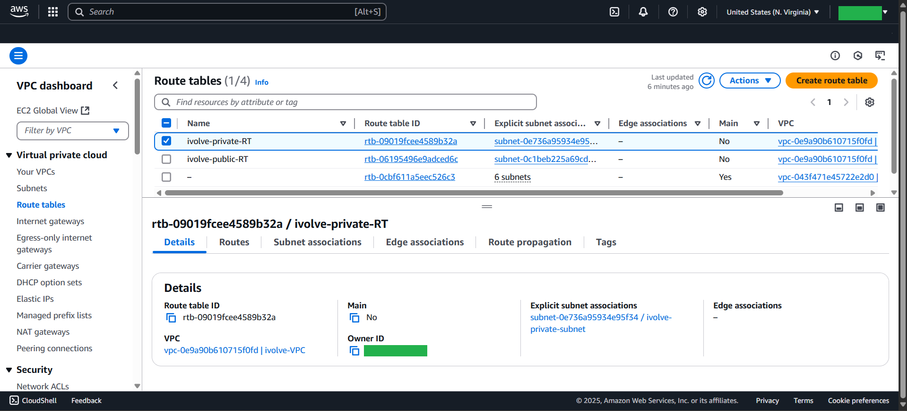

# EIP
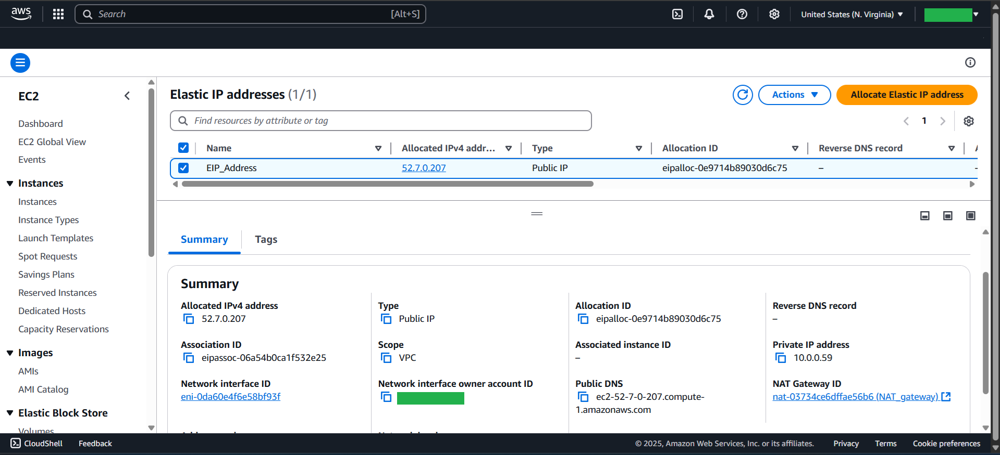

# NAT
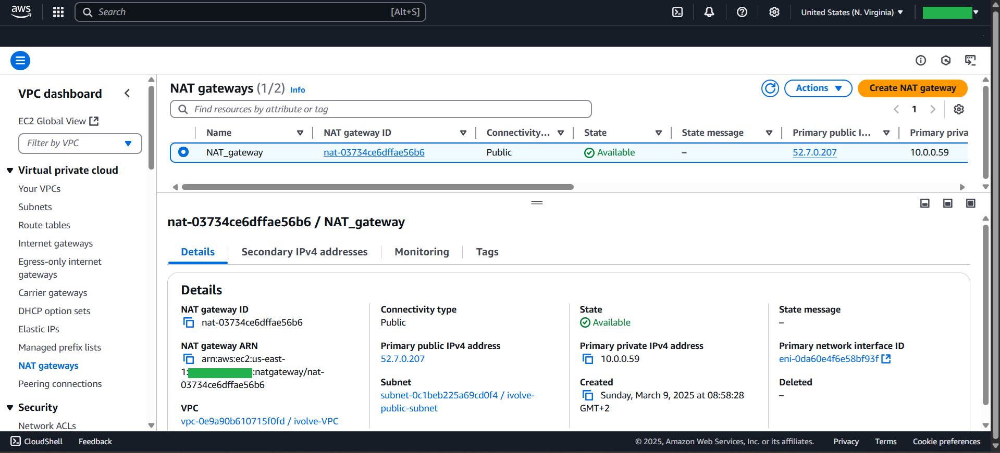

# Nginx EC2
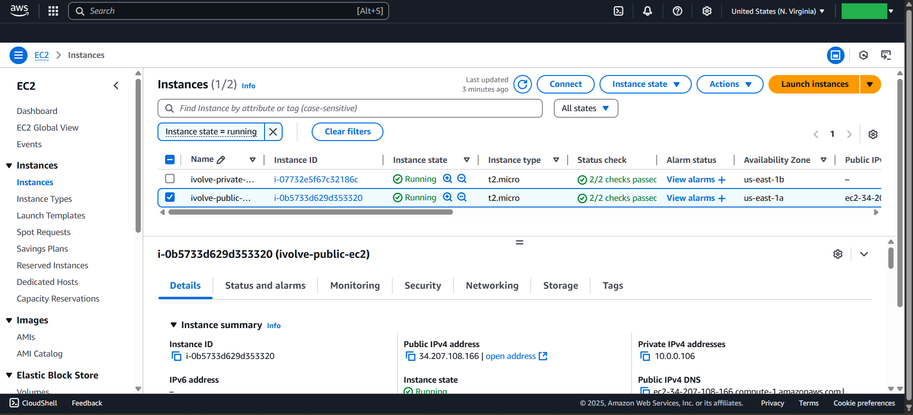
# Security Group for Nginx
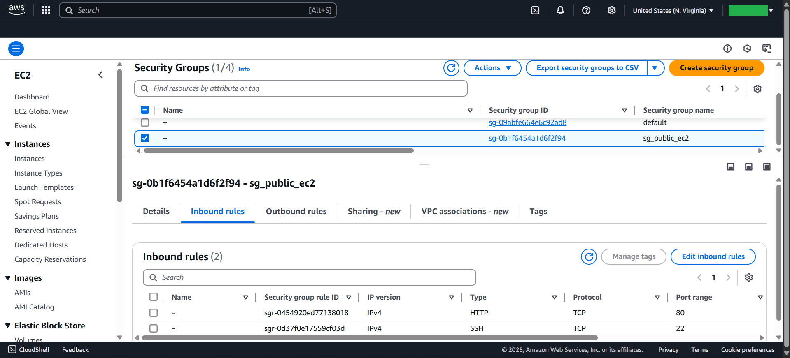

## Nginx Output
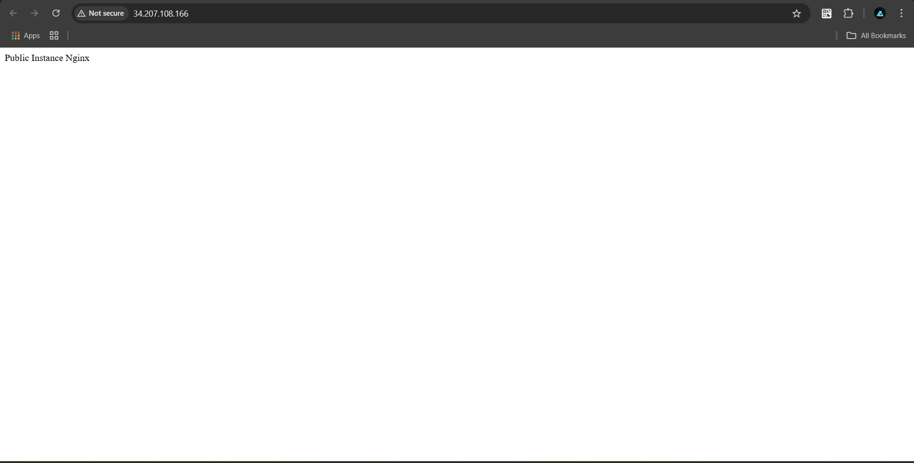

# Apache EC2
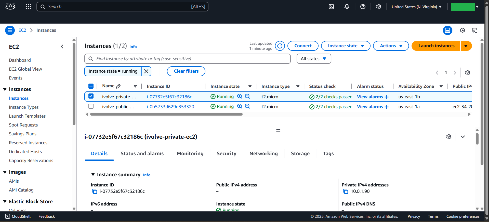
# Security Group for Apache
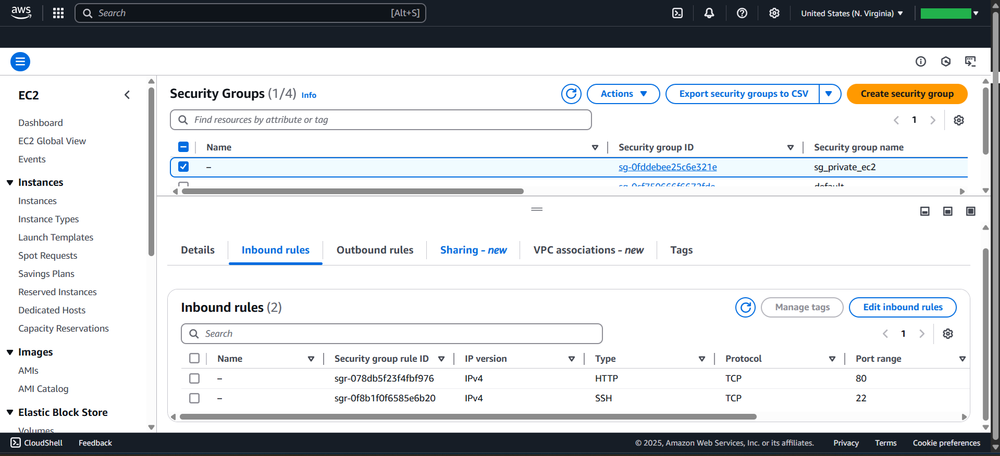

## Apache Output
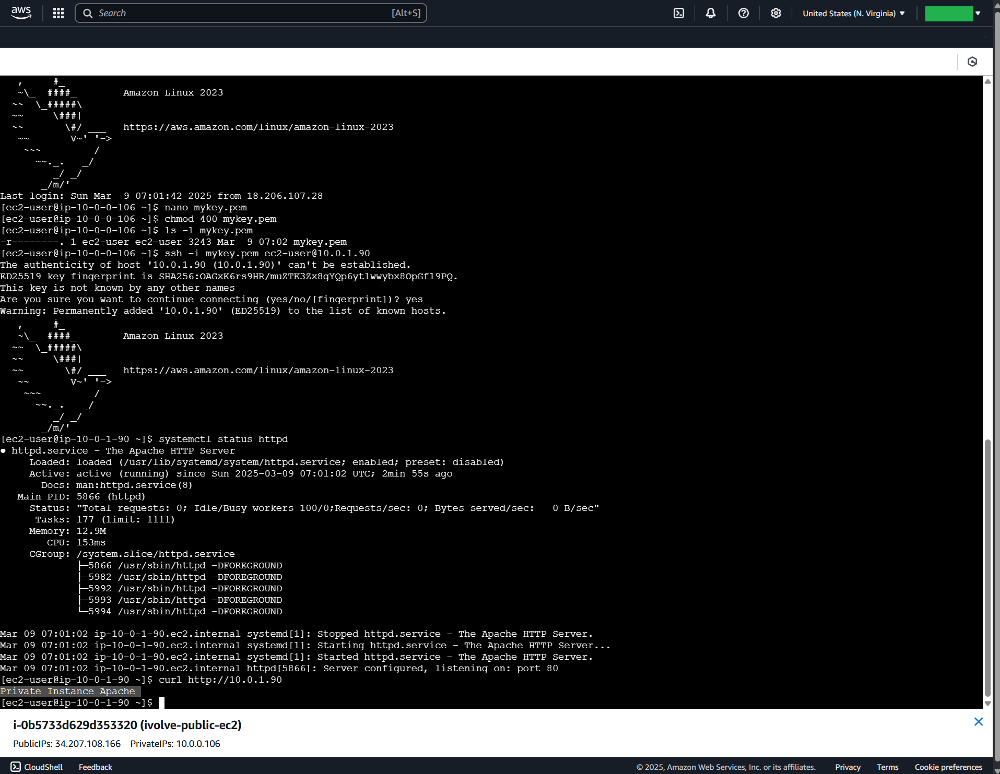